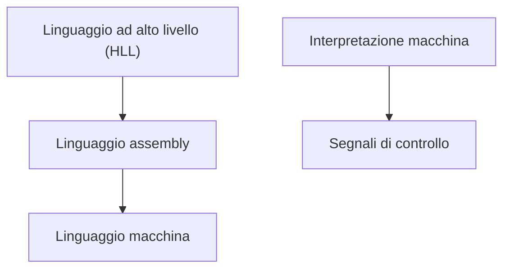
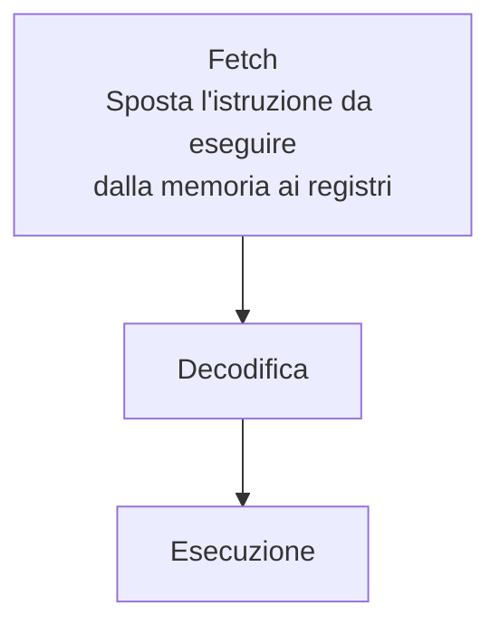

# Calcolatori

## Architettura di un computer

E' fatta a diversi livelli di astrazione:

Linguaggi:

## Architettura di Von Neumann

L'architettura di Von Neumann è **general purpose** a **programma memorizzato**, cioè può essere utilizzata per scopi generali. Viene definita così perché fino ad quel momento le macchine potevano fare solo una cosa, erano "specializzate", mentre ora si possono usare delle istruzioni per fare diverse operazioni.

E' composta da tre blocchi:

- **Unità d'ingresso**: programmi e dati in ingresso

- **Unità centrale**, composta a sua volta da:
  
  - Memoria: può essere considerata come un array di byte, le quali righe sono numerate da un valore chiamato **indirizzo** che parte da 0 $\to$ (grandezza memoria - 1).
  
  - CPU (central processing unit) composta da:
    
    - ALU (Aritmetic and logic unit): Non fa solo operazioni aritmetiche ma anche operazioni logiche (and, or, not, xor) e di traslazione (byte shift, byte rotate)
    
    - Unità di controllo: dà il giusto sincronismo alle altre unità. In particolare al suo interno c'è un registro (piccola memoria) che si chiama **program counter**

- **Unità di uscita**: schermo...

Per eseguire un'istruzione ci sono vari step:

All'interno di un processore ci sono tre tipi di bus diversi (con fili si intendono le piste fisiche di rame che collegano i pin della CPU ai pin delle altre unità):

- **Bus degli indirizzi**: ci passano le informazioni che riguardano l'indirizzo del dato che serve utilizzare nella ram. Dal punto di vista fisico ci sono una serie di cavi che collegano la CPU alla memoria. A seconda dello stato logico della corrente all'interno dei cavi si deduce l'indirizzo della cella. Il numero di linee che compongono il bus degli indirizzi esprime la quantità di celle di memoria che possono essere utilizzate dalla CPU ($2^n$).

- **Bus dei dati**: ci passano i dati che voglio scrivere o leggere dalla memoria. Il numero di linee che compongono il bus dei dati esprime la quantità di dati che possono essere elaborati contemporaneamente.

- **Bus di controllo**: insieme di fili che servono a dare i giusti comandi ai blocchi. Ad esempio il primo blocco della RAM e il primo blocco della ROM hanno lo stesso indirizzo, visto che il bus dei dati e quello degli indirizzi è condiviso, se richiedo l'indirizzo 0 ci sarà un conflitto di dati sul bus. Per evitare questo il bus dei controlli conterrà un'informazione che abilita la memoria che deve rispondere in caso di accesso ad un indirizzo.

La **ROM** (Read Only Memory) mantiene le informazioni anche senza corrente, al contrario della **RAM** (Random Access Memory), che è **volatile**.

Nella rom sono salvate le operazioni che servono per avviare il sistema operativo, chiamate **BIOS** (Basic Input Output System). Da notare che non si può modificare.

## Ciclo di esecuzione

- **Fetch**: prelevamento dell'istruzione che viene salvata nell'**instruction register**. Viene fatto in diversi passaggi:
  
  - **(PC)$\to$MAR**: prende il contenuto di PC e lo mette nel registro MAR (Memory Address Register), 
  
  - **((MAR))$\to$MBR; (PC)+1$\to$PC**: copia dato in MAR (Indirizzo) e lo mette in MBR (Memory Buffer Register) e incrementa il program counter che ora punta all'istruzione successiva
  
  - **(MBR)$\to$IR**: IR (Instruction register)

- **Decodifica**: viene identificata l'istruzione sulla base dell'**OPCode** (operation code)

- **Esecuzione**: dipende dall'istruzione e serve ad attivare le sezioni della CPU interessate e a mandargli i dati

Il **codice operativo** identifica un'istruzione mentre gli **operandi** sono i parametri dell'istruzione.

- **Sorgente**: dati da cui operare

- **Destinazione**: dove mettere il risultato

- **Modalità di indirizzamento**: non sono cazzi tuoi

## Modalità di indirizzamento

# Aritmetica del calcolatore

Le relazioni tra i bit e i numeri sono definite da **convenzioni**, cioè un numero binario può essere interpretato come un numero decimale diverso in base alla convenzione usata. Ad esempio il numero a 8 bit:

| 1   | 0   | 0   | 1   | 0   | 1   | 1   | 1   |
|:---:|:---:|:---:|:---:|:---:|:---:|:---:|:---:|

può essere convertito come 139 se lo consideriamo un intero o magari 2.45 se lo consideriamo un float.

**Problema dei numeri negativi**

Ci sono tre potenziali modi in cui indicare i numeri negativi:

- Modulo e segno

- Complemento a uno

- Complemento a due

Le cose da tenere in considerazione per capire quali usare sono il bilanciamento, il numero di zeri e la facilità con cui si effettuano le operazioni aritmetiche.

#### Modulo e segno

Nel sistema modulo e segno (Binario Naturale) si utilizza il bit più significativo per indicare il segno del numero, mentre i restanti bit rappresentano il modulo.

Il calcolatore deve disporre di almeno due operazioni matematiche semplici per comporre espressioni più complesse: **addizione e sottrazione**.

Utilizzando questo metodo di encoding per fare la somma algebrica di due numeri il calcolatore dovrebbe controllare i segni, verificare il maggiore tra i due numeri e attivare il circuito di addizione o di sottrazione il base ai risultati delle verifiche. I precedenti passaggi non possono essere eseguiti simultaneamente perché ognuno dipende dal risultato del precedente, quindi si utilizzerebbe un circuito unico utilizzando un metodo che permette di evitare tutte le operazioni di confronto.

#### Complemento alla base

Nella rappresentazione in complemento alla base di un numero di base $b$ di $n$ cifre, le $b^n$ combinazioni rappresentano numeri negativi e positivi.

- Le combinazioni da 0 a $b^n/2 -1$ rappresentano i numeri positivi

- Le combinazioni da $b^n/2$ fino a $2^n -1$ rappresentano i numeri negativi

Dato un numero positivo $X$, il suo corrispondente negativo è dato da $b^n - X$.

**Per farlo rapidamente si parte dal bit meno significativo e lascio uguali tutte le cifre che incontro fino al primo 1 compreso, il resto le inverto**.

#### Complemento a due

Il complemento a due è effettivamente il numero che devo sommare per raggiungere il numero più alto di quella lunghezza.

- Le combinazioni da 0 a $b/2 – 1$ rappresentano i numeri positivi, rispettando la usuale rappresentazione posizionale;

- Le combinazioni da $b/2$ fino a $b – 1$ rappresentano i numeri negativi,

Dato un numero positivo $X$, il suo corrispondente negativo è dato da $(b^n -1)-X$.

**Per farlo rapidamente inverto tutte le cifre del numero**.

Con il complemento si può usare un unico circuito per somme e sottrazioni.

Il problema dei numeri a lunghezza fissa è che se il risultato è maggiore del numero massimo o minore del numero minimo rappresentabile con quelle cifre, il risultato cambia di segno ed esce un numero sbagliato. Il fenomeno si chiama **overflow**.

## Operazioni con complemento a due

Per negare un numero si invertono tutti i bit e si aggiunge 1.

Per convertire un numero di $N$ bit in un numero di lunghezza maggiore, il MIPS copia la cifra più significativa nei posti rimanenti per raggiungere la lunghezza desiderata, questa si chiama **estensione del segno**.

Nelle operazioni con segno o unsigned e confronti che usano operandi a 16/8 bit, il calcolatore converte tutto a 32 bit estendendo il segno.

Le istruzioni **lbu** e **lhu non effettuano estensione di segno**.

Per scoprire l'overflow di segno in MIPS Assembly:

Senza segno: 

Shiftare un numero di $n$ bit a destra o a sinistra equivale a moltiplicarlo e dividerlo per $2^n$, visivamente si spostano le posizioni delle cifre a destra o a sinistra di $n$.

L'AND bit a bit prende due numeri e mette confrontando ogni bit e risultando uno se tutti e due i bit in quella posizione valgono 1.

Per l'OR basta che solo uno dei due bit valga 1.

Lo XOR mette 1 solo se uno dei die valori è 1.

# ALU (Arithmetic Logic Unit)

![[/Users/xtc/Desktop/Schermata 2024-06-06 alle 18.49.15.png]] ALU a 1 bit.

Per costruire una ALU a 32 bit si possono unire 32 ALU a 1 bit.

#### ALU a 32 bit

Per costruire una ALU a 1 bit che implementi le operazioni AND e OR bisogna essere in grado di eseguire l'operazione corretta in base al valore del bit **operation**. Per fare questo, visto che abbiamo solo due possibili operazioni, possiamo usare un **multiplexer (mux)** a due ingressi. Collegando i risultati dei gate AND e OR ai due ingressi del mux, possiamo decidere quale risultato mandar fuori.

![[/Users/xtc/Desktop/Schermata 2024-06-06 alle 18.54.49.png]] ALU a 1 bit con mux

Ora si passa alla somma. Per sommare due numeri dobbiamo considerare anche il resto della somma del blocco precedente e il resto generato da quello corrente.

![[/Users/xtc/Desktop/Schermata 2024-06-06 alle 18.58.12.png]]

Per integrare questa operazione nella nostra ALU devo estendere il mux, che ora sarà a 3 ingressi. devo anche aggiungere un ingresso per il **CarryIn** e un'uscita per il **CarryOut**. Unendo più ALU dobbiamo ricordarci di unire un il CarryOut di un blocco con il CarryIn del blocco successivo.

![[/Users/xtc/Desktop/Schermata 2024-06-06 alle 19.01.09.png]] ![[/Users/xtc/Desktop/Schermata 2024-06-06 alle 19.01.19.png]]

Supportare la sottrazione è una cosa semplice, basta negare $b$ e aggiungere 1 per fare il complemento a 2, aggiungendo un mux a due ingressi per attivare o meno la sottrazione.

![[/Users/xtc/Desktop/Schermata 2024-06-06 alle 19.04.35.png]]

Per supportare l'istruzione slt (set if less than) bisogna usare un test di uguaglianza. Siccome sono tutte operazioni aritmetiche si può usare una sottrazione perché se $(a - b) = 0$, allora $a=b$.

![[/Users/xtc/Desktop/Schermata 2024-06-06 alle 19.48.24.png]]

Per implementare un'uguaglianza si controlla che l'output di tutti i risultati sia 0 con un and e si nega.

![[/Users/xtc/Desktop/Schermata 2024-06-06 alle 19.50.59.png]]

#### Moltiplicazione

La moltiplicazione è un'operazione più complicata e viene eseguita shiftando una somma. Ci sono tre modi per farla.

**Primo modo**

**Secondo modo**

**Terzo modo**

## Algoritmo di booth

L'algoritmo di Booth è un metodo per moltiplicare numeri binari che gestisce efficientemente i moltiplicatori negativi, riducendo il numero di operazioni di addizione e sottrazione richieste. È particolarmente utile in hardware per la moltiplicazione veloce di numeri binari. Ecco una spiegazione dettagliata di come funziona l'algoritmo di Booth.

#### Passaggi Principali:

1. **Preparazione**:
   
   - Inizializza il registro prodotto e i registri di spostamento con il valore del moltiplicando e del moltiplicatore.
   - Aggiungi un bit di "quoziente" al moltiplicatore, inizializzato a 0.

2. **Scorrimento del Moltiplicatore**:
   
   - Scorri il moltiplicatore e osserva i bit successivi. Ogni coppia di bit successivi determina quale operazione eseguire:
     - **10**: Sottrai il moltiplicando dal prodotto.
     - **01**: Aggiungi il moltiplicando al prodotto.
     - **00** o **11**: Nessuna operazione.

3. **Aggiorna e Sposta**:
   
   - Dopo aver eseguito l'operazione (se necessaria), sposta il registro del prodotto e il moltiplicatore a destra (arithmetic shift right) per una posizione. Il bit più significativo del prodotto viene copiato nel bit di segno del prodotto stesso per preservare il segno (aritmetico).

4. **Ripeti**:
   
   - Ripeti i passaggi fino a che tutti i bit del moltiplicatore sono stati elaborati.

5. **Risultato**:
   
   - Al termine delle iterazioni, il registro del prodotto contiene il risultato finale della moltiplicazione.

### Esempio

Consideriamo un esempio per chiarire il funzionamento dell'algoritmo di Booth. Supponiamo di voler moltiplicare 3 (011 in binario) per -4 (1100 in binario, in complemento a due a 4 bit).

#### Step 1: Inizializzazione

- Moltiplicando \(M\) = 0011 (3)
- Moltiplicatore \(Q\) = 1100 (-4)
- Registro del prodotto \(P\) = 0000
- Quoziente iniziale \(Q_{-1}\) = 0

#### Step 2: Scansione e Operazioni

| Iterazione | P    | Q    | Q\(-1\) | Operazione              |
| ---------- | ---- | ---- | ------- | ----------------------- |
| Iniziale   | 0000 | 1100 | 0       | -                       |
| 1          | 0000 | 1100 | 0       | Sottrai M (P = P - M)   |
|            | 1101 | 1100 | 0       | Arithmetic Shift Right  |
| 2          | 1110 | 0110 | 0       | Nessuna operazione (00) |
|            | 1111 | 0110 | 1       | Arithmetic Shift Right  |
| 3          | 1111 | 1011 | 1       | Aggiungi M (P = P + M)  |
|            | 0110 | 1011 | 1       | Arithmetic Shift Right  |
| 4          | 0011 | 1101 | 1       | Sottrai M (P = P - M)   |
|            | 1110 | 1101 | 1       | Arithmetic Shift Right  |
| Finale     | 1111 | 1110 | 1       | Fine (Risultato)        |

#### Step 3: Risultato Finale

Dopo aver completato tutte le iterazioni, il registro del prodotto contiene il risultato della moltiplicazione. In questo esempio, il risultato nel registro del prodotto è \(11111000\), che rappresenta -12 in complemento a due, confermando la moltiplicazione corretta di 3 per -4.

### Vantaggi dell'Algoritmo di Booth

1. **Efficienza**: Riduce il numero di operazioni richieste per la moltiplicazione, specialmente con sequenze di 0 e 1 consecutivi.
2. **Gestione dei Numeri Negativi**: Gestisce naturalmente i numeri negativi grazie all'uso del complemento a due.
3. **Hardware**: È facilmente implementabile in hardware, rendendolo adatto per unità di moltiplicazione nei processori.

# Algebra di Boole

L'algebra di Boole è un ramo dell'algebra che si occupa di variabili e operazioni logiche. Utilizzata ampiamente in informatica, elettronica digitale e teoria degli insiemi, l'algebra di Boole manipola variabili binarie che assumono solo due valori: vero (1) e falso (0).

#### Operazioni di Base

1. **AND (congiunzione)**: A⋅B o A∧B
   
   - Risulta vero solo se entrambi gli operandi sono veri.
   
   - Tabella di verità:
     
     | A   | B   | A AND B |
     | --- | --- | ------- |
     | 0   | 0   | 0       |
     | 0   | 1   | 0       |
     | 1   | 0   | 0       |
     | 1   | 1   | 1       |

2. **OR (disgiunzione)**: A+B o A∨B
   
   - Risulta vero se almeno uno degli operandi è vero.
   
   - Tabella di verità:
     
     | A   | B   | A OR B |
     | --- | --- | ------ |
     | 0   | 0   | 0      |
     | 0   | 1   | 1      |
     | 1   | 0   | 1      |
     | 1   | 1   | 1      |

3. **NOT (negazione)**: ¬A o A′
   
   - Inverte il valore dell'operando.
   
   - Tabella di verità:
     
     | A   | NOT A |
     | --- | ----- |
     | 0   | 1     |
     | 1   | 0     |

#### Proprietà Fondamentali

1. **Identità**:
   
   - A+0=A
   - A⋅1=A

2. **Nulla**:
   
   - A+1=1
   - A⋅0=0

3. **Idempotenza**:
   
   - A+A=A
   - A⋅A=A

4. **Complementarietà**:
   
   - A+A′=1
   - A⋅A′=0

5. **Involuzione**:
   
   - (A′)′=A

6. **Commutatività**:
   
   - A+B=B+A
   - A⋅B=B⋅A

7. **Associatività**:
   
   - A+(B+C)=(A+B)+C
   - A⋅(B⋅C)=(A⋅B)⋅C

8. **Distributività**:
   
   - A⋅(B+C)=(A⋅B)+(A⋅C)
   - A+(B⋅C)=(A+B)⋅(A+C)

9. **Assorbimento**:
   
   - A+(A⋅B)=A
   - A⋅(A+B)=A

10. **De Morgan**:
    
    - (A⋅B)′=A′+B′
    - (A+B)′=A′⋅B′

#### Teoremi Principali

1. **Teoremi di De Morgan**:
   
   - ¬(A∧B)=¬A∨¬B
   - ¬(A∨B)=¬A∧¬B

2. **Teorema della dualità**: Ogni espressione booleana è valida se rimane valida quando si scambiano AND e OR e si sostituiscono 0 con 1 e 1 con 0.

### Mappe di Karnaugh

Le mappe di Karnaugh (K-map) sono uno strumento grafico per semplificare espressioni booleane, rendendo più facile individuare e eliminare termini ridondanti.

#### Procedura di Base

1. **Costruzione della Mappa**:
   
   - Per una funzione di n variabili, si crea una mappa di 2n celle.
   - Ogni cella rappresenta una combinazione unica delle variabili.
   - La disposizione delle celle segue un ordine Gray code (solo un bit cambia tra celle adiacenti).

2. **Riempimento della Mappa**:
   
   - Inserire i valori della funzione booleana nelle celle corrispondenti.

3. **Raggruppamento**:
   
   - Raggruppare celle adiacenti con valore 1 in potenze di 2 (1, 2, 4, 8, ...).
   - Gruppi possono essere orizzontali, verticali e avvolgenti.

4. **Scrittura dell'Espressione Minima**:
   
   - Ogni gruppo di celle genera un termine dell'espressione semplificata.
   - Un gruppo elimina le variabili che cambiano all'interno del gruppo.

![[/Users/xtc/Desktop/Schermata 2024-06-06 alle 20.21.45.png]]

#### Esempio

Consideriamo una funzione booleana di tre variabili A, B, e C:

- $F(A,B,C)=∑m(1,3,4,5,7)$

**K-map**:

| AB\C | 00  | 01  | 11  | 10  |
| ---- | --- | --- | --- | --- |
| 00   | 0   | 1   | 1   | 0   |
| 01   | 0   | 1   | 1   | 0   |

**Raggruppamento**:

- Gruppo 1: m(1,3) ⇒ A′BC
- Gruppo 2: m(4,5) ⇒ AB′C′

**Espressione Minima**:

- F(A,B,C)=A′BC+AB′C′

Le mappe di Karnaugh forniscono un metodo visuale per semplificare espressioni logiche complesse e sono uno strumento utile nella progettazione di circuiti digitali.

## Funzioni booleane

Le funzioni booleane possono essere espresse in diverse forme canoniche che forniscono rappresentazioni standardizzate delle espressioni logiche. Le due forme canoniche principali sono la Prima Forma Canonica (Forma Normale Disgiuntiva, FND) e la Seconda Forma Canonica (Forma Normale Congiuntiva, FNC). Queste forme standardizzano le espressioni logiche, facilitando la comprensione e la manipolazione delle funzioni booleane.

### Prima Forma Canonica (Forma Normale Disgiuntiva, FND)

La Prima Forma Canonica, o Forma Normale Disgiuntiva (FND), è un'espressione booleana rappresentata come una somma di prodotti (SOP). Cioè, è una disgiunzione (OR) di termini, dove ciascun termine è una congiunzione (AND) di variabili o dei loro complementi.

$$
F=f_0\centerdot m_0 + f_1 \centerdot m_1 + \ldots + f_{2^n-1}\centerdot m_{2^n-1} = \sum^{2^n-1}_{1=0}f_i\centerdot m_i
$$

#### Definizione

Ogni termine nella FND è un mintermine, che è un prodotto (AND) di tutte le variabili della funzione, ciascuna delle quali può essere nella forma normale o complementata. La FND rappresenta la funzione booleana come una somma (OR) di questi mintermini.

#### Esempio

Consideriamo una funzione booleana di tre variabili A, B, e C:

$F(A,B,C)=A′B′C+AB′C′+ABC$

In questo esempio:

- $A′B′C$ è un mintermine che corrisponde alla combinazione A=0, B=0, C=1.
- $AB′C′$ è un mintermine che corrisponde alla combinazione A=1, B=0, C=0.
- $ABC$ è un mintermine che corrisponde alla combinazione A=1, B=1, C=1.

### Seconda Forma Canonica (Forma Normale Congiuntiva, FNC)

La Seconda Forma Canonica, o Forma Normale Congiuntiva (FNC), è un'espressione booleana rappresentata come un prodotto di somme (POS). Cioè, è una congiunzione (AND) di termini, dove ciascun termine è una disgiunzione (OR) di variabili o dei loro complementi.

#### Definizione

Ogni termine nella FNC è un maxtermine, che è una somma (OR) di tutte le variabili della funzione, ciascuna delle quali può essere nella forma normale o complementata. La FNC rappresenta la funzione booleana come un prodotto (AND) di questi maxtermini.

#### Esempio

Consideriamo una funzione booleana di tre variabili A, B, e C:

$F(A,B,C)=(A+B′+C)(A′+B+C′)(A+B+C)$

In questo esempio:

- $(A+B′+C)$ è un maxtermine che corrisponde alla combinazione A=1, B=0, C=1.
- $(A′+B+C′)$ è un maxtermine che corrisponde alla combinazione A=0, B=1, C=0.
- $(A+B+C)$ è un maxtermine che corrisponde alla combinazione A=1, B=1, C=1.

### Relazione tra Mintermini e Maxtermini

- **Mintermini**: Ogni mintermine rappresenta una combinazione di variabili che rende la funzione booleana vera. La somma di tutti i mintermini che rendono vera la funzione fornisce la FND.
- **Maxtermini**: Ogni maxtermine rappresenta una combinazione di variabili che rende la funzione booleana falsa. Il prodotto di tutti i maxtermini che rendono falsa la funzione fornisce la FNC.

### Conversione tra FND e FNC

- Per convertire dalla FND alla FNC (e viceversa), si possono utilizzare i teoremi di De Morgan e le proprietà duali dell'algebra di Boole. Ogni mintermine della FND può essere complementato e trasformato in un maxtermine della FNC e viceversa.

### Esempio Pratico

Supponiamo di avere una funzione booleana definita dalla seguente tabella di verità:

| A   | B   | C   | F(A,B,C) |
| --- | --- | --- | -------- |
| 0   | 0   | 0   | 1        |
| 0   | 0   | 1   | 0        |
| 0   | 1   | 0   | 1        |
| 0   | 1   | 1   | 1        |
| 1   | 0   | 0   | 0        |
| 1   | 0   | 1   | 1        |
| 1   | 1   | 0   | 0        |
| 1   | 1   | 1   | 1        |

- **FND**: Si sommano i mintermini corrispondenti ai valori di verità 1:
  
  $F(A,B,C)=A′B′C′+A′BC′+A′BC+AB′C+ABC$

- **FNC**: Si moltiplicano i maxtermini corrispondenti ai valori di verità 0:
  
  $F(A,B,C)=(A+B+C′)(A+B′+C)(A′+B+C)(A′+B+C′)$

Queste forme canoniche permettono una rappresentazione standardizzata e semplificata delle funzioni booleane, essenziale per la progettazione e l'analisi di circuiti logici.

# Rappresentazione normalizzata di numeri reali

Ogni numero reale $a\ne 0$ può essere rappresentato in modo univoco in base $b>1$ nella forma

$$
\alpha = sign(\alpha) \centerdot b^\beta \sum^\infin_{i=1}d_i\centerdot b^{-1}
$$

con

$$
\beta \in \Z, d_i \ne 0, sign(\alpha)= +1 if \alpha>0 : -1 if \alpha<0
$$

In generale, per rappresentare qualunque numero $A\in\R$ si prende:

1. Il segno di a (+=0, -=1)

2. Le cifre significative di $A$, anche dette mantissa, in forma normalizzata. La mantissa può andare da $\frac{1}{B^n}$ a 1 non incluso.

3. L'esponente $E$ a cui dovremo elevare la base del numero per ottenere il fattore per cui moltiplicare la mantissa per ottenere $A$

#### Floating point numbers

per avere una rappresentazione efficace è conveniente:

- Eliminare simboli ridondanti

- Fissare le lunghezze di mantissa ed esponente

- Utilizzare una convenzione che permetta di utilizzare esponenti sia positivi che negativi senza esplicitare il segno, ciò si fa sommando una costante

- disporre segno, mantissa ed esponente in questo ordine

| S   | E   | M   |
|:---:|:---:|:---:|

Incrementando la lunghezza della mantissa si aumenta la precisione, mentre aumentando quella dell'esponente si aumenta il range dei numeri rappresentabili.

**Standard IEEE 754**

Questo standard definisce come devono essere rappresentati numeri reali in due diversi modi:

- Single precision floating point numbers:
  
  Bias 127
  
  | S (1bit) | E (8bit) | M (23bit) |
  | -------- | -------- | --------- |

- Double precision floating point numbers:
  
  Bias 1023
  
  | S (1bit) | E (11bit) | M (52bit) |
  | -------- | --------- | --------- |

Lo standard soffre anche del fenomeno di **underflow**. Inoltre vengono tenuti 2 bit extra per indicare **infinito**, **NaN**, arrotondamento per eccesso o per difetto.

Per convertire praticamente bisogna:

- Convertire in binario

- Normalizzare

- Rappresentare secondo lo standard

Esempio con 75.125

| 75      | 125 |
| ------- | --- |
| 1001011 | 001 |

| S = 0 (+) | E = 6+127 (bias) | M = .87   |
| --------- | ---------------- | --------- |
| 0         | 10000101         | 001011001 |

# Architettura MIPS semplificata

A scopo educativo è stata semplificata l'architettura del processore MIPS per implementare:

- Istruzioni di riferimento alla memoria: `lw, sw`

- Istruzioni aritmetiche e logiche: `add, sub, and, or, slt`

- Istruzioni di controllo: `beq, j`

Questa implementazione generica utilizza il program counter per l'indirizzo delle istruzioni, legge le istruzioni dalla memoria, legge i registri e usa le istruzioni lette per decidere esattamente cosa fare. Tutte le istruzioni utilizzano la ALU dopo aver letto i registri.

L'architettura si presenta nel seguente modo:

#### Tipi di elementi

Ci sono due diversi tipi di elementi presenti in questa architettura:

- **Elementi combinatori** nei quali l'output è dipendente solamente dagli input che riceve in quel preciso istante

- **Elementi sequenziali** nei quali l'output dipende sia dagli ingressi in quel momento, sia dallo stato di uno degli elementi circostanti come memorie, registri, flip flop, ecc...
  
  Per riprodurre un certo output bisogna riprodurre esattamente lo stato della macchina, o anche solamente lo stato degli elementi che lo circondano. 
  
  Gli elementi sequenziali hanno bisogno di almeno due segnali in ingresso, uno per il valore da scrivere e uno per il **clock** per determinare la scrittura, mentre la lettura può avvenire in qualsiasi momento.

Gli elementi che mantengono uno stato possono essere **clocked** o **unclocked**:

### Elementi Clocked

Un elemento "clocked" (sincronizzato) del processore è un componente che opera in sincronia con un segnale di clock. Il segnale di clock è un'onda quadrata che cicla tra due stati (alto e basso) a intervalli regolari, fornendo un segnale di temporizzazione uniforme per l'intero sistema.

#### Caratteristiche degli Elementi Clocked:

1. **Sincronizzazione**: Le operazioni si verificano in sincronia con il fronte (positivo o negativo) del segnale di clock. Tipicamente, i dati vengono catturati o aggiornati durante il fronte di salita (da basso ad alto) o il fronte di discesa (da alto a basso) del clock.
   
   

2. **Determinismo**: Le operazioni sono determinate dal clock, rendendo più facile il controllo e la predizione del comportamento del circuito.

3. **Tipici Elementi Clocked**:
   
   - **Flip-Flop**: Un flip-flop è un bistabile controllato dal clock che può memorizzare un bit di informazione. Esistono diversi tipi di flip-flop, come D flip-flop, JK flip-flop, e T flip-flop.
   - **Registri**: Un registro è un insieme di flip-flop che memorizzano una parola di dati (più bit).

#### Vantaggi:

- **Sincronizzazione**: Facilita la gestione e la sincronizzazione dei dati.
- **Stabilità**: Riduce i problemi di temporizzazione (racing conditions).

#### Svantaggi:

- **Consumo di energia**: Richiede un segnale di clock continuo, che può aumentare il consumo di energia.
- **Latenza**: Può introdurre latenza, poiché le operazioni sono vincolate al ciclo di clock.

### Elementi Unclocked (Set-Reset Latch)

Un elemento "unclocked" (asincrono), come un set-reset latch, è un componente che opera indipendentemente dal segnale di clock. Questi elementi cambiano stato immediatamente in risposta ai segnali di input, senza aspettare il prossimo ciclo di clock.

#### Caratteristiche degli Elementi Unclocked:

1. **Asincronia**: Le operazioni non sono legate a un segnale di clock e possono avvenire in qualsiasi momento in risposta a un cambiamento negli input.

2. **Tipici Elementi Unclocked**:
   
   - **Latch SR (Set-Reset)**: Un latch SR ha due ingressi, Set (S) e Reset (R), che controllano lo stato dell'uscita. L'uscita cambia immediatamente in risposta agli input:
     - Se S=1 e R=0, l'uscita è impostata a 1.
     - Se S=0 e R=1, l'uscita è resettata a 0.
     - Se S=0 e R=0, l'uscita mantiene il suo stato attuale.
     - Se S=1 e R=1, la condizione è indeterminata e dovrebbe essere evitata.

#### Vantaggi:

- **Velocità**: Può rispondere immediatamente ai cambiamenti negli input senza aspettare un ciclo di clock.
- **Efficienza energetica**: Non richiede un segnale di clock continuo, potenzialmente riducendo il consumo di energia.

#### Svantaggi:

- **Gestione della temporizzazione**: Può essere più difficile da gestire in sistemi complessi a causa della mancanza di sincronizzazione.
- **Racing Conditions**: Maggiore suscettibilità ai problemi di temporizzazione come le racing conditions.

#### Applicazioni

- **Elementi Clocked**: Utilizzati in registri, contatori, e altre parti del processore dove la sincronizzazione è critica.
- **Elementi Unclocked**: Utilizzati in latch semplici, come memoria temporanea, e in circuiti dove la risposta immediata è necessaria.

### D-latch

#### Componenti Principali:

- **Ingresso D (Data)**: L'ingresso attraverso il quale viene fornito il dato da memorizzare.
- **Ingresso E (Enable)**: L'ingresso di abilitazione che controlla quando il dato viene memorizzato.
- **Uscita Q**: L'uscita che mantiene il valore memorizzato.
- **Uscita Q' (opzionale)**: L'uscita complementare di Q.

![[/Users/xtc/Desktop/Schermata 2024-06-09 alle 17.37.39.png]]

![[/Users/xtc/Desktop/Schermata 2024-06-09 alle 17.37.49.png]]

#### Funzionamento:

- **Enable = 1 (attivo)**: Quando il segnale di abilitazione (E) è alto, il latch è "trasparente" e l'uscita Q segue direttamente l'ingresso D. Cioè, qualsiasi cambiamento nel valore di D viene immediatamente riflesso in Q.
- **Enable = 0 (non attivo)**: Quando il segnale di abilitazione (E) è basso, il latch "memorizza" il valore presente all'uscita Q al momento della disattivazione. In altre parole, Q mantiene il valore che aveva quando E è passato da alto a basso, indipendentemente da ulteriori cambiamenti in D.

#### Tabella di Verità:

| Enable (E) | Data (D) | Output (Q) |
| ---------- | -------- | ---------- |
| 0          | X        | Q          |
| 1          | 0        | 0          |
| 1          | 1        | 1          |

(X indica che l'ingresso può essere qualsiasi valore; Q mantiene il suo stato precedente)

#### Caratteristiche

1. **Trasparenza**: Il D-latch è detto "trasparente" perché quando l'abilitazione è attiva, l'uscita segue direttamente l'ingresso.
2. **Memoria**: Quando l'abilitazione è disattivata, il latch memorizza il valore dell'uscita.
3. **Asincronia**: Il D-latch non richiede un clock continuo, ma utilizza un segnale di abilitazione per controllare quando aggiornare l'uscita.

#### Applicazioni

- **Memoria Temporanea**: Utilizzato per memorizzare temporaneamente i dati in sistemi digitali.
- **Buffer**: Utilizzato per sincronizzare i dati tra due stadi di un circuito.
- **Registri**: Parte di registri più complessi in unità di elaborazione.

### D flip-flop

#### Componenti Principali:

- **Ingresso D (Data)**: L'ingresso attraverso il quale viene fornito il dato da memorizzare.
- **Ingresso Clock (Clk)**: Il segnale di clock che controlla quando il dato viene memorizzato.
- **Uscita Q**: L'uscita che mantiene il valore memorizzato.
- **Uscita Q' (opzionale)**: L'uscita complementare di Q.

![[/Users/xtc/Desktop/Schermata 2024-06-09 alle 17.42.31.png]]

![[/Users/xtc/Desktop/Schermata 2024-06-09 alle 17.42.36.png]]

#### Funzionamento:

- **Fronte di salita del Clock (Rising Edge)**: Quando il segnale di clock passa da basso ad alto, l'uscita Q assume il valore dell'ingresso D in quel momento specifico. Q rimane stabile e mantiene questo valore fino al prossimo fronte di salita del clock.

- **Fronte di discesa del Clock (Falling Edge)**: In alcuni flip-flop, il cambiamento può avvenire al fronte di discesa del clock, quando il segnale di clock passa da alto a basso.

#### Tabella di Verità:

| Clock (Clk) | Data (D) | Output (Q) |
| ----------- | -------- | ---------- |
| ↑           | 0        | 0          |
| ↑           | 1        | 1          |
| 0 o 1       | X        | Q          |

(↑ indica un fronte di salita del clock, e X indica che l'ingresso può essere qualsiasi valore; Q mantiene il suo stato precedente)

#### Circuito Logico Interno

Un D flip-flop può essere implementato utilizzando latch master-slave o altri meccanismi di sincronizzazione. Ecco un esempio di implementazione usando latch master-slave:

#### Implementazione con Latch Master-Slave:

Un D flip-flop può essere realizzato combinando due D-latch in configurazione master-slave. Il primo latch (master) cattura il dato quando il clock è basso, e il secondo latch (slave) cattura il dato del master quando il clock è alto.

#### Caratteristiche

1. **Sincronizzazione**: L'uscita cambia solo al fronte specifico del clock, fornendo una temporizzazione deterministica.
2. **Memoria**: Mantiene lo stato fino al prossimo fronte di clock, rendendo il flip-flop utile per memorizzare dati in sistemi sincroni.
3. **Stabilità**: Minimizza il rischio di condizioni di corsa e problemi di temporizzazione, poiché i dati vengono catturati solo in momenti specifici.

### Differenza tra D Latch e D Flip-Flop

- **D Latch**: L'uscita segue l'ingresso quando l'abilitazione è attiva. Asincrono rispetto al clock.
- **D Flip-Flop**: L'uscita cambia solo al fronte del clock (rising edge o falling edge). Sincronizzato con il clock.

### Register file

Un "register file" (insieme di registri) è un componente essenziale di molti processori, utilizzato per memorizzare e gestire i registri. Il register file consente al processore di leggere e scrivere rapidamente dati nei registri, supportando l'esecuzione di istruzioni. I registri sono composti da D flip flop in serie. Nell'architettura MIPS questo file ha 4 ingressi e 2 uscite:

- 2 ingressi per i registri in lettura

- 1 ingresso per il registro in scrittura

- 1 ingresso per il dato da scrivere

- 2 uscite per leggere due dati allo stesso tempo

Tutte le operazioni di lettura e scrittura sono temporizzate dal clock.

![[/Users/xtc/Desktop/Schermata 2024-06-09 alle 18.00.53.png]]

#### Lettura

Le operazioni di lettura sono gestite da due mux, il cui output è definito dai numeri negli ingressi di lettura.

![[/Users/xtc/Desktop/Schermata 2024-06-09 alle 18.05.37.png]]

#### Scrittura

Durante la scrittura, un decodificatore seleziona il registro su cui scrivere e l'operazione viene effettivamente attuata solo quando il write è affermativo sul pin del clock.

![[/Users/xtc/Desktop/Schermata 2024-06-09 alle 18.08.37.png]]

### Implementazione dell'architettura

Per implementare l'architettura completa ci vogliono alcuni elementi funzionali:

1) ![[/Users/xtc/Desktop/Schermata 2024-06-09 alle 18.12.17.png]]  Instruction memory

2)  Program counter

3) ![[/Users/xtc/Desktop/Schermata 2024-06-09 alle 18.12.29.png]] Adder

4) ![[/Users/xtc/Desktop/Schermata 2024-06-09 alle 18.12.37.png]] Registers

5) ![[/Users/xtc/Desktop/Schermata 2024-06-09 alle 18.12.43.png]] ALU

6) ![[/Users/xtc/Desktop/Schermata 2024-06-09 alle 18.12.51.png]] Data memory unit

7) ![[/Users/xtc/Desktop/Schermata 2024-06-09 alle 18.12.57.png]] Sign extension unit

#### Istruzioni e program counter

Dopo ogni istruzione il program counter va incrementato di 4. Viene fatto con un adder che prende com input il PC e 4. Una volta incrementato viene passato all' instruction memory, che come output ha l'istruzione che viene puntata dal PC.

![[/Users/xtc/Desktop/Schermata 2024-06-10 alle 10.09.34.png]]

La suddetta istruzione viene decodificata e se è di tipo R viene passata al register file che manda il contenuto dei registri interessati alla ALU per fare i calcoli. La ALU rimanda poi al register file il risultato dell'operazione da salvare nel registro di destinazione.

Per trasferire dati dalla memoria, come ad esempio in un per `lw $t1, 4($t2)`, il processore usa l'unità di estensione del segno per l'immediato 4 e lo manda alla ALU per sommarlo al valore di `$t2` e calcolare così l'indirizzo della word da caricare. Il valore viene utilizzato per leggere la memoria dati e mettere in `$t1` il risultato. 

L'intera procedura è sincronizzata usando tre segnali di controllo:

- **RegWrite**: Attivato per scrivere il valore letto dalla memoria nel registro `$t1`.
- **MemRead**: Attivato per leggere il valore dalla memoria all'indirizzo calcolato.
- **ALU operation**: Configurata per eseguire una somma per calcolare l'indirizzo.

Le istruzioni di branch vengono eseguite a partire dall'estensione del segno per l'offset dell'indirizzo di branch e il suo successivo offset a sinistra di due posizioni (moltiplicazione per 4 perché le istruzioni hanno 4 byte o 32 bit). Successivamente viene eseguito il confronto dei registri per decidere se si deve fare o meno il branch attivando l'uscita `zero` della ALU. Se l'uscita a zero è attiva il nuovo indirizzo viene scritto nel PC.

Mettendo tutto insieme si ha:

## Approccio multiciclo

Alcune operazioni, come ad esempio le operazioni con i floating point, non possono essere eseguite completamente in un solo ciclo di clock, quindi si implementa l'approccio multiciclo.

Con questo approccio le istruzioni vengono divise in vari step che verranno eseguiti uno ogni ciclo. Il data path risulta essere più complicato, ma molto efficace.

![[Primo anno/Calcolatori/1.png]]

Per capire come viene eseguita un'istruzione bisogna tenere a mente che per ogni ciclo si può fare solo un'operazione per ogni modulo, e in generale si divide così:

- **Instruction fetch**: in cui si usa il PC per prendere l'istruzione e metterla nell'IR. In questo step si incrementa anche il pc di 4 per passare all'istruzione successiva.

- **Instruction Decode and Register Fetch**: se necessario si leggono i registri RS e RT, che servono per memorizzare le informazioni tra un ciclo e l'altro. In caso l'istruzione sia un salto si legge anche l'indirizzo di salto e si calcola l'obiettivo passando dal sign extender e dallo shifting.

- **Instruction dependent**: questa parte è strettamente dipendente dall'istruzione che si sta eseguendo:
  
  - Se si legge la memoria si fa `A + sign-extend(IR[15-0])` 
  
  - Se è un'istruzione di tipo R `A op B`
  
  - Con il branch `if (A==B) PC = ALUOut`

- **Memory access or R-type instruction completition**: per quanto riguarda le istruzioni di tipo R c'è solo bisogno di salvare l'output della ALU nel registro stabilito, mentre per le altre operazioni solitamente si salva in memoria qualcosa.

- **Write-Back**: scrive i dati dalla memoria ai registri

![[Primo anno/Calcolatori/3.png]]

![[Primo anno/Calcolatori/4.png]]

## Exceptions

Le eccezioni sono dei sistemi per identificare diversi tipi di fallimento del sistema, che possono essere ad esempio:

- **Istruzione non definita**: in questo caso si controlla il valore dell'op code e nel caso in cui il valore non rientri nel valido set operativo si genera un **interrupt**

- **Overflow aritmetico**: viene identificato dalla ALU

In questi casi l'architettura prende provvedimenti, cioè salva il PC dell'istruzione in questione nel registro EPC (Exception Program Counter), continua con le istruzioni per l'error handling e ristorna al codice originale all'istruzione successiva per riavviare.

Per intervenire con il codice ci sono due metodi:

- Usando un registro di stato (o di causa) il sistema operativo analizza l'errore e lo gestisce, con il vantaggio di avere un singolo entry point al codice di gestione dell'eccezione per qualsiasi tipo di fallimento.

- Con l'interrupt vettorizzato per ogni causa si salva un vettore che punta al pezzo di codice appropriato.

Per gestire le eccezioni bisogna estendere l'architettura, quindi anche l'albero standard degli stati.

![[Primo anno/Calcolatori/5.png]]

![[Primo anno/Calcolatori/6.png]]
