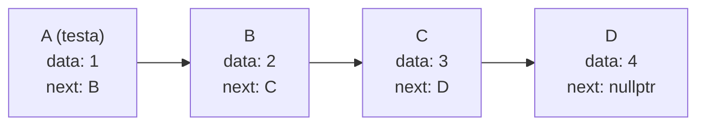

# C++

```cpp
[[include]] <iostream>

using namespace std;

int main() {
  cout << "ciao mondo!";
  return 0;
}
```

## Include

```cpp
[[include]] <iostream>
```

**#include** è una direttiva per il preprocessore o precompilatore che serve per includere file o librerie nel codice che si sta scrivendo. Includendo un file sarà possibile utilizzare tutte le classi, le funzioni, i namespace e le variabili presenti all'interno.

In questo caso si sta importando la libreria standard **iostream**, che serve per operazioni di input e output con la console.

Ci sono due tipi di [[include]]:

- Con le parentesi angolari:
  
  ```cpp
  [[include]] <iostream>
  ```
  
  Si utilizza per includere le librerie non presenti nella cartella in cui si sta lavorando ma inserite all'interno delle cartelle predefinite per la ricerca dei file del compilatore.

- Con le virgolette:
  
  ```cpp
  [[include]] "file.cpp"
  ```
  
  Si utilizza per includere i file presenti nella cartella in cui si sta lavorando oppure nelle sottocartelle.

## Namespace

Per capire cosa sono i namespace prima bisogna capire cos'è **lo scope**. In poche parole lo scope e uno spazio nel quale le variabili dichiarate possono essere utilizzate. In poche parole uno scope è definito da una coppia di parentesi graffe {}. Ad esempio:

```cpp
int main() {
  // variabile
  int age = 0;

  // stampa la variabile
  cout << age;
  return 0;
}
```

Le variabili all'esterno di qualsiasi coppia di parentesi si chiamano **variabili globali**

```cpp
// variabile
int age = 0;

int main() {
  // stampa la variabile
  cout << age;
  return 0;
}
```

Nello stesso scope non ci possono essere due variabili o funzioni con lo stesso nome e se se viene dichiarata una variabile con lo stesso nome in uno scope più basso sarà visibile solo quest'ultima variabile.

```cpp
// variabile
int age = 0;

int main() {
  // variabile con lo stesso nome ma diverso valore
  int age = 57;

  // stampa la variabile
  cout << age; // 57
  return 0;
}
```

Uno scope può essere definito anche da una coppia di parentesi senza nome che non definisce una funzione o una classe.

```cpp
int main() {
  // scope 1
  {
    int age = 57;
    cout << age;
  }

  // scope 2
  {
    int age = 20;
    cout << age;
  }

  // non funziona perché age non è nello scope ma in uno sottostante
  cout << age;
  return 0;
}
```

I name space sono stati introdotti per dare un nome a queste coppie vuote di parentesi e ai gruppi di variabili, classi e funzioni che hanno lo stesso scopo.

Tutta la libreria standard del c++ è stata inserita all'interno del namespace **std**.

Per utilizzare una funzione si utilizza la dicitura:

```cpp
namespace::variabile
```

dove la :: si chiama **scope operator**.

Se si sta utilizzando molte volte lo stesso name space si può utilizzare una dicitura per dire al compilatore di cercare automaticamente le funzioni che non trova in un certo namespace:

```cpp
using namespace std;
```

L'esempio del professore senza questa riga sarebbe così:

```cpp
[[include]] <iostream>

int main() {
  std::cout << "Ciao mondo";
  return 0;
}
```

## Funzioni

Un sottoprogramma o funzione è un insieme di istruzioni identificate da un nome che può essere richiamato all’interno del programma principale o all’interno dei sottoprogrammi.

Per dichiarare una funzione si usa una sintassi ben definita: 

```cpp
<tipo> <nome>(<argomenti>) {
    /// codice
}
```

- **tipo**: rappresenta il tipo di dato che la funzione restituisce. Per restituire un valore da una funzione si usa la keyword `return` seguita dal valore o dal nome della variabile che si vuole restituire. Se la funzione non restituisce nessun valore la funzione deve essere di tipo `void` e si può anche non mettere il `return`.

- **nome**: è il nome che si vuole dare alla funzione.

- **argomenti**: è l'elenco degli argomenti che riceve la funzione, anche detti **parametri**. Gli argomenti vengono trattati dalla funzione come se fossero variabili, quindi si possono modificare e leggere a piacere.

```cpp
int main() {
  std::cout << "Ciao mondo";
  return 0;
}
```

Ogni istruzione dopo il return viene ignorata.

Il main è una funzione particolare perché è la prima che viene eseguita quando si avvia il programma, anche detta **entry point** del programma.

```cpp
int somma(int a, int,b) {
  return a+b;
}

int main(){
  // chiamata della funzione
  int risultato = somma(50, 20);

  // verrà stampato 70
  cout << risultato;
} 
```

## Variabili

Le variabili si creano facendo `<tipo> <nome> = <valore>;`

```cpp
int nome = 5;
```

Se ad una variabile non viene assegnato nessun valore essa avrà il valore che è scritto nello spazio della RAM dove è fisicamente allocata la variabile, quindi sarà casuale.

## Operatori

- \*: moltiplicazione

- /: divisioni

- +: somma

- \-: sottrazione

- %: modulo o resto della divisione tra interi

- += valore: incrementa la variabile del valore specificato
  
  ```cpp
  variabile += 5;
  variabile = variabile + 5;
  ```

- -= valore: sottrae alla variabile il valore specificato
  
  ```cpp
  variabile -= 5;
  variabile = variabile - 5;
  ```

Questi ultimi due operatori non aumentano la capacità espressiva del linguaggio e valgono ugualmente per la divisione e per la moltiplicazione.

- ++: incrementa di 1 il valore della variabile. Ci sono due modi per utilizzare questa operazione: se viene scritto variabile++, la variabile viene prima utilizzata nell'espressione e poi incrementata. Se si usa ++variabile è il contrario

- --: stessa cosa di ++ ma decrementa di 1;

- **bool**: può assumere solo due valori, vero o falso.

## Tipi di dato

- **int**: numero intero con segno 32bit (-2.147.483.648, +2.147.483.647). il primo bit è il bit di segno

- **unsigned int**: numero intero senza segno 32bit (0, +4.294.967.295). il primo bit è il bit di segno

- **short int**: numero intero con segno 16bit (-32.768, +32.767). il primo bit è il bit di segno

- **short unsigned int**: numero intero senza segno 16 bit

- **float**: numeri in virgola mobile 32 bit

- **double**: numeri in virgola mobile 64 bit. Hanno più precisioni con numeri molto piccoli o molto grandi

- **char**: carattere singolo 8 bit in codice ASCII (ogni codice associato ad un simbolo) (-128, +127)

- **unsigned char**: char senza segno 8 bit (0, +255) nel codice le stringhe si indicano con le virgolette

```cpp
char carattere = 'A';
```

I valori costanti si indicano con `const` e non possono essere modificate

```cpp
const int variabile = 5;
```

Se un float viene moltiplicato con un int il risultato sarà un float, quindi il tipo più capiente. E' comunque preferibile fare operazioni con variabili dello stesso tipo per evitare conflitti ed errori.

Non posso assegnare un valore ad una variabile di un tipo diverso a parte per gli int: gli int sono contenuti nei float quindi posso assegnare un int ad un float, ma non un float ad un int.

Posso convertire un tipo ad un altro utilizzando l'operatore di **casting**, anche se a volte perdiamo alcune informazioni. Se questo operatore viene utilizzato durante una espressione viene cambiato solo momentaneamente il tipo alla variabile, non si modifica il valore o la variabile stessa. L'operatore di casting ha la precedenza sulle operazioni matematiche.

```cpp
float a = 5.456;
int b = (int)a; // b = 5
```

La divisione tra numeri int risulterà un int, anche se ha il resto: 5/4 = 1. Tutte le altre risultano float.

## Istruzioni di controllo

Servono per adattare il comportamento del programma a diverse situazioni. La prima è if.

```cpp
if(condizione) {
    // operazioni in caso la condizione sia vera
} else {
    // operazioni in caso la condizione sia falsa
}
```

Se bisogna eseguire una sola operazione si possono omettere le parentesi graffe.

```cpp
float a = 0;
float b = 1.345;
int c;

if(a != 0) 
    c = b / a;
else 
    c = a + b;
```

Ci sono diversi operatori per le condizioni:

- **==**: uguale

- **!=**: diverso
  
  | C   | !(C) |
  | --- | ---- |
  | V   | F    |
  | F   | V    |

- **>  <  >=  <=**: maggiore, minore, maggiore o uguale, minore o uguale

- **||**: and
  
  | C1  | C2  | \|\| |
  | --- | --- | ---- |
  | F   | F   | F    |
  | F   | V   | V    |
  | V   | F   | V    |
  | V   | V   | V    |

- **&&**: or
  
  | C1  | C2  | &&  |
  | --- | --- | --- |
  | F   | F   | F   |
  | F   | V   | F   |
  | V   | F   | F   |
  | V   | V   | V   |

Se un valore è 0 viene considerato falso, in qualsiasi altro caso viene considerato true.

**Non si fanno confronti alla cazzo: solo due valori alla volta stronzo!!!!!!!!!!!**

## Libreria standard

```cpp
cout << risultato;
```

Cout è una proprietà della libreria standard che permette di stampare sulla console quello che vogliamo. Le due parentesi angolari sono un operatore <<.

## Cicli

Un ciclo è un blocco di istruzioni che deve essere ripetuto più volte. Ci sono diversi tipi di cicli:

- **while**
  
  Esegue le azioni da svolgere a ripetizione fino a che la condizione è vera
  
  ```cpp
  while (condizione) {
      // azioni da svolgere
  }
  ```

- **for**
  
  Esegue le azioni da svolgere fino a che la condizione è vera. Offre un maggior controllo sulle iterazioni.
  
  ```cpp
  for (int i = 0; i < 10; i++) {
      // azioni da svolgere
      // in questo caso vengono ripetute 10 volte
  }
  ```

- **do while**
  
  A differenza degli altri due cicli, il **do while** esegue almeno una volta le istruzioni presenti nel **do**.
  
  ```cpp
  do {
      // azioni da svolgere
  } while (condizione)
  ```

```cpp
int main()
{
    int v;

    while (1)
    {
        cout << "inserisci un valore: ";
        cin >> v;
        v % 3 ? break : continue;
    }

    cout << "OK" << endl;
    return 0;
}
```

```cpp
for (int i = 1; i <= n; i++) somma += n;
```

Ci sono due istruzioni che servono per **controllare** o **alterare** il ciclo:

- **break**: quando viene eseguita si esce immediatamente dal ciclo senza eseguire altri passaggi

- **continue**: passa direttamente alla prossima iterazione senza finire di eseguire le istruzioni rimanenti per concludere il ciclo

Gli **switch** servono per evitare scrivere lunghe serie di if...else: 

```cpp
// con if
int i = 0;
cin >> i;

if(i == 1) {
    // codice
}
if(i == 2) {
    // codice
}
if(i == 3) {
    // codice
}
switch(i)
```

```cpp
// con switch
int i = 0;
cin >> i;

switch(i) 
{
    case 1:
        // istruzioni
        break;
    case 2:
        // istruzioni
        break;
    case 3:
        // istruzioni
        break;
    default:
        // istruzioni
        break;
}
```

Il default serve per gestire tutti i valori che non vogliamo considerare o che sono inaspettati, come se mettessimo un else alla fine.

## Ricorsione

Le funzioni ricorsive sono funzioni che al proprio interno invocano se stesse.

Prendiamo come esempio il fattoriale:

$$
\begin{split}
n ! &= n*(n-1)*(n-2)*......*2*1 \\
6 ! &= 6*5*4*3*2*1 = 720
\end{split}
$$

Per farlo nel modo classico si può fare in questo modo:

```cpp
int fattoriale (int m) {
    int f = 1;
    while (m > 1) {
        f = f*m;
        m--;
    }
    return f;
}
```

Usando la ricorsione:

```cpp
int fattoriale (int m) {
    if (m > 1)
        /// la funzione chiama se stessa con m più basso
        return m*fattoriale(m-1);
    else        
    return 1;
}
```

```flowchart
st=>start: Inizio
op=>condition: m > 1?
calc=>operation: Calcola m * fattoriale(m-1)
ret=>operation: Restituisce il risultato

st->op->cond
op(yes)->calc(left)->op
op(no)->ret
```

# Liste

Una lista è una struttura dati lineare in cui gli elementi sono collegati tra loro da puntatori. Ogni elemento, chiamato nodo, contiene due campi principali:

- `data`: Questo campo memorizza il valore dell'elemento.

- `next`: Questo campo è un puntatore al nodo successivo nella lista.

La lista è composta da una serie di nodi collegati tra loro attraverso i puntatori `next`. La lista può essere vuota (quando il puntatore alla testa è `nullptr`) o può contenere uno o più nodi.



Per definire la struttura di un nodo si utilizzano gli `struct`:

```cpp
struct Node {
    int data;
    Node* next;
};
```

### Inserimento in Coda

L'inserimento di un elemento in coda alla lista implica i seguenti passaggi:

1. Allocazione di memoria per il nuovo nodo: O(1) in termini di complessità temporale, poiché richiede solo un'allocazione di memoria.
2. Impostazione del valore del nuovo nodo: O(1), poiché coinvolge solo l'assegnazione di un valore a un campo della struttura.
3. Collegamento del nuovo nodo all'ultimo nodo esistente: O(n) nel caso peggiore, poiché potrebbe essere necessario attraversare tutta la lista per trovare l'ultimo nodo.
4. Aggiornamento del puntatore `next` dell'ultimo nodo per puntare al nuovo nodo: O(1), poiché coinvolge solo l'assegnazione di un valore a un campo della struttura.

Complessità temporale totale per l'inserimento in coda: O(n).

La complessità spaziale dell'inserimento in coda è O(1), poiché viene utilizzato un quantitativo costante di memoria aggiuntiva per memorizzare il nuovo nodo.

In concreto si fa così:

```cpp
void insertimentoInCoda(Node* &head, int value) {
    Node* newNode = new Node(); // Allocazione di memoria per il nuovo nodo
    newNode->data = value;      // Impostazione del valore del nodo
    newNode->next = nullptr;    // Inizializzazione del puntatore al prossimo nodo a nullptr

    if (head == nullptr) {
        head = newNode; // Se la lista è vuota, il nuovo nodo diventa la testa
    } else {
        Node* temp = head;
        while (temp->next != nullptr) {
            temp = temp->next; // Spostarsi al prossimo nodo fino a raggiungere l'ultimo nodo
        }
        temp->next = newNode; // Collegare il nuovo nodo all'ultimo nodo
    }
}
```

### Inserimento in Testa

L'inserimento di un elemento in testa alla lista implica i seguenti passaggi:

1. Allocazione di memoria per il nuovo nodo: O(1).
2. Impostazione del valore del nuovo nodo: O(1).
3. Collegamento del nuovo nodo al nodo successivo (la vecchia testa): O(1).
4. Aggiornamento del puntatore alla testa della lista per puntare al nuovo nodo: O(1).

Complessità temporale totale per l'inserimento in testa: O(1).

La complessità spaziale dell'inserimento in testa è O(1), poiché viene utilizzato un quantitativo costante di memoria aggiuntiva per memorizzare il nuovo nodo.

Questa è una spiegazione della struttura di una lista concatenata, inclusi i dettagli sull'inserimento in coda e in testa, con considerazioni sulla complessità temporale e spaziale.

```cpp
void inserimentoInTesta(Node* &head, int value) {
    Node* newNode = new Node(); // Allocazione di memoria per il nuovo nodo
    newNode->data = value;      // Impostazione del valore del nodo
    newNode->next = head;       // Il prossimo nodo diventa la testa corrente
    head = newNode;             // Il nuovo nodo diventa la nuova testa
}
```

L'unico errore che può capitare è che non si riesca a creare un nuovo nodo perché manca memoria, per evitarlo bisogna fare un controllo:

```cpp
if (newNode == nullptr) {
    /// affrontare l'errore
}
```

## Ricerca

Visto che una lista concatenata non ha accesso casuale agli elementi come un array, la ricerca in una lista usa l'attraversamento sequenziale della lista partendo dalla testa fino a trovare l'elemento desiderato o raggiungere la fine della lista.

```cpp
bool search(Node* head, int value) {
    Node* current = head;
    while (current != nullptr) {
        if (current->data == value) {
            return true; // Elemento trovato
        }
        current = current->next; // Passa al nodo successivo
    }
    return false; // Elemento non trovato
}
```
