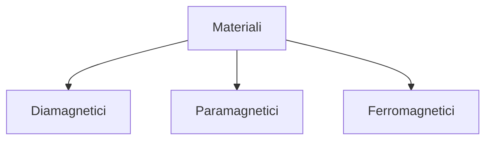

# Elettrotecnica(++)

L'elettrotecnica utilizza dei surrogati dei campi elettromagnetici come in fisica: **tensione**, **corrente** e **carica elettrica**. I surrogati agiscono secondo le leggi di **Kirchhoff** e di **Ohm** e non secondo quelle di **Maxwell** come in fisica.

- Le cariche elettriche generano campi elettrici

- Le cariche elettriche in movimento creano campi magnetici

Leggi di **Maxwell**:

- Legge di `Gauss per il campo elettrico`: il flusso di un campo elettrico attraverso una superficie chiusa è dato dal rapporto tra la carica elettrica totale interna alla superficie e la costante dielettrica assoluta del mezzo.
  
  $$
  \oiint_S \bar{E}\cdot \bar{u}_n dS=\frac{Q}{\epsilon_0} \qquad \epsilon_0=\text{costante dielettrica nel vuoto}
  $$

- Legge di `Gauss per il campo magnetico`: il flusso del campo magnetico attraverso una qualsiasi superficie è nullo.
  
  $$
  \oiint_S \bar{B}\cdot\bar{u}_n dS = 0
  $$

- Legge di `Faraday-Henry`: la forza elettromotrice indotta è uguale alla variazione nel tempo del flusso del campo magnetico attraverso una superficie, e descrive il fenomeno di induzione elettromagnetica, cioè una variazione di flusso dei campi magnetici.
  
  $$
  \oint_L \bar{E}\cdot d\bar{l}=-\frac{d}{dt}\oiint_{S(L)}\bar{B}\cdot\bar{u}_ndS
  $$

- Legge di `Ampere-Maxwell`: la circuitazione del campo magnetico in generale non è nulla, e ci si calcola come prodotto tra la costante di permeabilità magnetica nel vuoto e le somme delle correnti concatenate nel percorso chiuso. Le correnti sono all’origine dei campi magnetici.
  
  $$
  \oint_L \bar{B}\cdot d\bar{l} = \mu_0l + \mu_0\epsilon_0 \frac{d}{dt}\oiint_{S(L)}\bar{E}\cdot \bar{u}_ndS
  $$

- `Equazione di continuità`: la carica interna ad una qualsiasi superficie chiusa di un conduttore attraversato da corrente è costante nel tempo
  
  $$
  \oiint_A \bar{J}\cdot \bar{u}_ndA= -\frac{dQ}{dt}\phi-\frac{d}{dt}\iiint_V \rho dV
  $$

Le cariche elettriche possono essere stazionarie o in movimento, nel primo caso si parla di **elettrostatica**, nel secondo di **elettrodinamica**. L'elettrodinamica si divide in:

- `Stazionaria`: la densità di corrente è $\ne$ 0 ma tutte le derivate rispetto al tempo sono $=$ 0, quindi i fenomeni non cambiano nel tempo. Anche se modifiche ai campi elettrici e magnetici come allargamento e restringimento sono consentiti a patto che si torni sempre al punto di partenza

- `Quasi stazionaria`: solo alcune delle derivate rispetto al tempo sono nulle

- `Non stazionaria`: le cariche non si muovono

## Regime stazionario

Le cariche ci sono e si muovono ma tutte le derivate rispetto al tempo delle equazioni di maxwell sono nulle, cioè campi elettrici e magnetici sono cose a se stanti.

`Circuito elettrico`: tubo di flusso del vettore densità di corrente

`Rete elettrica`: unione di circuiti diversi

`Ramo o lato`: tubo di flusso del vettore densità di corrente nel quale si può considerare la corrente uguale in ogni sezione

`Nodo`: punto in cui convergono 3 o più lati

`Nodo degenere`: punto in cui convergono solo due lati

`Maglia`: un qualunque percorso chiuso che partendo da un nodo, ritorni allo stesso nodo percorrendo rami diversi della rete, senza mai percorrere un ramo più di una volta.

### Legge di Kirchhoff ad un percorso chiuso

Legge di Faraday-Henry

$$
\oint_L \bar{E}\cdot d\bar{l}=0 
$$

`La somma algebrica delle tensioni presenti sui lati di un percorso chiuso è uguale a 0`

$$
\sum V=0
$$

che è la legge di Kirchhoff per un percorso chiuso e non vale in regime non stazionario. La tensione è anche possibile vederla come una variazione di quota.

`La somma algebrica delle correnti presenti sui lati di un percorso chiuso è uguale a 0`

$$
\oiint \bar{J}\cdot\bar{u_n}dA=0
$$

$$
\sum I = 0
$$

che è l'equazione di continuità sempre nel regime stazionario

### Bipoli

![[Secondo Anno/Elettrotecnica/Schermata 2024-09-19 alle 11.52.43.png]] Bipolo in cui i due capi sono i morsetti o poli

Il bipolo è un modello matematico di un fenomeno elettrico di nostro interesse, ma oltre ad avere una rappresentazione matematica ha anche un simbolo.

### Fenomeno resistivo (Ohmico)

Il moto delle cariche elettriche all'interno di un materiale, esclusi i **super-conduttori**, incontrerà per forza un'opposizione al movimento (come in meccanica non esiste un moto senza attrito, tranne che nel vuoto), quindi per ogni movimento di una carica nel materiale, essa dovrà spendere dell'energia. Vedendo la cosa da un punto di vista energetico il punto di partenza di una carica dovrà possedere un potenziale elettrico maggiore del punto di arrivo. Osservando la dinamica, dovrà essere un campo elettrico (**forzante**) applicato ad una particella carica a farle vincere la resistenza al moto del materiale e farle cambiare di posizione.

$$
V(v)=R(\Omega)I(A)\qquad \text{resistenza}
$$

$$
R=\rho\frac{l_{unghezza}}{S_{ezione}}\qquad \text{resistività}
$$

![[Secondo Anno/Elettrotecnica/Schermata 2024-09-19 alle 12.00.53.png]] La resistenza dipenda dalle dimensioni e dal materiale usato

$$
I=GV\qquad \text{conduttanza}
$$

$$
\frac{1}{g}=\rho\qquad\text{conducibilità}
$$

La resistività permette di fare una classificazione dei materiali in:

- `Conduttori`: materiali con bassa resistività

- `Isolanti`: materiali con alta resistività

- `Semiconduttori`: materiali che in certe condizioni possono condurre o isolare a piacere.

### Resistore

![[Secondo Anno/Elettrotecnica/Schermata 2024-09-19 alle 12.06.33.png]]

$V$ è l differenza di potenziale tra il morsetto in cui la $I$ è entrante e quello in cui è uscente.

`Convenzione degli utilizzatori`

- La corrente può fluire sia da $A\to B$ sia $A\leftarrow B$. Se cambia il verso della corrente, la tensione cambia di segno, in questo caso si dice che il componente è bidirezionale e simmetrico se la resistenza è uguale in entrambi i casi.

- La resistività di un materiale dipende in modo importante dalla temperatura (termocoppie e termometri), ma assumiamo a scopo di semplificazione che la temperatura sia sempre costante.

### Generatore ideale di tensione e corrente

![[Secondo Anno/Elettrotecnica/Schermata 2024-09-19 alle 12.31.35.png]]                      ![[Secondo Anno/Elettrotecnica/Schermata 2024-09-19 alle 12.35.49.png]]

Il generatore ideale di tensione è ideale se la forza elettro-motrice che genera non dipende dalla corrente che circola. Quindi la sua caratteristica è una retta parallela all'asse della corrente.

Il generatore ideale di corrente è la stessa cosa.

Questi generatori non sono realizzabili nella realtà a meno che non si usi un dispositivo che controlla i valori di tensione e corrente nel circuito, tuttavia è molto utile nell'analisi dei circuiti.

`Convenzione dei generatori`

- La corrente viene misurata come la differenza di potenziale tra il morsetto in cui la corrente esce e il morsetto in cui la corrente entra

### Generatori reali

![[Secondo Anno/Elettrotecnica/Schermata 2024-09-19 alle 12.40.59.png]]                    ![[Secondo Anno/Elettrotecnica/Schermata 2024-09-19 alle 12.41.09.png]]

Una modellizzazione più realistica dei generatori è quella di associare ad un generatore di tensione una resistenza in serie, mentre a quello di corrente una resistenza in parallelo. Le resistenze rappresentano la caduta di tensione che la corrente ha passando all'interno del generatore di tensione e la caduta di potenza per il generatori di corrente.

Altri bipoli sono il `Corto circuito (ctocto)` oppure il `Circuito aperto`. Il `Diodo ideale` è l'unione tra il corto circuito e il circuito aperto

### Diodo ideale

Tutti i bipoli visti finora sono lineari ad eccezione del diodo  

### Serie e parallelo

I bipoli possono essere messi in serie o in parallelo

- `Serie`: ciascuno dei bipoli è posto in successione rispetto al precedente, quindi il morsetto in cui esce la corrente nel primo bipolo è collegato al borsetto in cui entra la corrente nel secondo. Ne risulta che la corrente che attraversa i bipoli è la stessa, mentre la tensione sarà la somma algebrica delle tensioni che attraversano i singoli bipoli.
  
  Se si pongono in serie due generatori di tensione, la tensione totale sarà la somma algebrica delle tensioni di ciascuno.
  
  Se si mettono in parallelo i generatori di tensione o in serie i generatori di corrente esplode tutto.
  
  `Resistenze in serie`
  
  $$
  V_{AB} = R_1I+R_2I+\dots+R_nI=\sum_jR_jI
  $$

- `Parallelo`: Se si pongono in parallelo dei generatori di corrente, la corrente totale è la somma algebrica delle correnti di ciascuno.
  
  `Resistenze in parallelo`
  
  $$
  I=\frac{V}{R_1}+\frac{V}{R_2}+\dots+\frac{V}{R_n}=\sum_j\frac{1}{R_j}
  $$

La conduttanza è il reciproco della resistenza

$$
G=\frac{1}{R}
$$

### Metodi sistematici per la risoluzione delle reti

Risolvere una rete significa che data una rete completamente definita e vogliamo calcolare tutte le correnti e le tensioni sui lati della rete stessa. Non è sempre possibile risolvere una rete, ma solo se ho tante equazioni quante sono le incognite. Le equazioni devono essere indipendenti.

Gli strumenti che si utilizzano per risolvere le reti sono:

- Legge delle **Correnti**

- Legge delle **Tensioni**

- Legge di **Ohm**

Questi strumenti verranno poi combinati in vari modi per ottenere un sistema di equazioni che come incognite ha le incognite del sistema elettrico da risolvere.

Le prime due leggi hanno come riferimento soltanto la tipologia della rete e non alla natura dei suoi lati. Il grafo di una rete viene costruito sostituendo i bipoli con un segmento di linea che congiunge i nodi della rete.

Un `grafo connesso` è un tipo di grafo che permette di prendere due nodi a caso e trovare sempre un percorso che li congiunga fatto di lati.

Incognite:

- $l$ correnti di lato

- $l$ tensioni di lato

Equazioni:

- $n-1$ equazioni indipendenti ai nodi

- $m=l-n+1$ equazioni indipendenti alle maglie

- $l$ equazioni di Ohm (certamente indipendenti)

![[Secondo Anno/Elettrotecnica/8.png]]

Una `rete piana` è una rete per la quale riesco a disegnarne il grafo senza far accavallare due o più lati

La scelta delle maglie può essere fatta con libertà. La scelta el verso di tensioni e correnti possono anch'esse essere scelte a caso anche se è opportuno utilizzare le convenzioni di utilizzatori e generatori con un senso logico coerente per le frecce.

Per la soluzione si possono usare tre diversi metodi:

- Metodo delle tensioni di nodo

- Metodo delle correnti di lato

- Metodo delle correnti di maglia

**Metodo delle correnti di lato**

![[/Users/xtc/Desktop/Schermata 2024-09-26 alle 16.13.10.png]]                                                      ![[/Users/xtc/Desktop/Schermata 2024-09-26 alle 16.12.59.png]]

$R_i=5\Omega$    $E_3=30V$    $E_5=50V$    $E_7=70V$

In questo esercizio le maglie sono:

$$
(B\to C\to E)\quad(A\to D\to E)\quad(D\to C\to E)\quad(B\to A\to E)
$$

**Equazioni da trovare**:

$n-1=4$

$l=8 \quad n=5$

$m=8-5+1=4$

**Equazioni di Kirchhoff per le maglie**

$$
\begin{cases}
-V1 + V_2 + V_u = 0 \\
V_2 - V_3 - V_5 = 0 \\
V_6 + V_u + V_8 = 0 \\
V_7 + V_5 + V_B = 0
\end{cases}

$$

**Equazioni di Kirchhoff per i nodi**

$$
\begin{cases}
I_1 + I_3 - I_2 = 0 \\
I_5 + I_3 + I_8 = 0 \\
I_6 + I_7 + I_7 = 0 \\
I_2 + I_u + I_7 - I_5 = 0
\end{cases}
$$

**Leggi di Ohm**

$$
\begin{cases}
V_1 = R_1 I_1 \\
V_2 = R_2 I_2 \\
V_3 = E_3 - R_3 I_3 \\
V_5 = E_5 - R_5 I_5 \\
V_6 = R_6 I_6 \\
V_7 = E_7 - R_7 I_7 \\
V_8 = R_8 I_8
\end{cases}

$$

**Tensioni note**

$$
\begin{aligned}
V_{DA}, & \quad V_{BA}, \quad V_{EA}, \quad V_{CA}
\end{aligned}
$$

**Tensioni che posso prevedere**

$$
\begin{aligned}
\quad V_{CE}, \quad V_{BC}, \quad V_{ED}, \quad V_{BE}, \quad V_{DC}
\end{aligned}
$$

**Nel nodo B**

$$
I_1 + I_3 - I_2 = 0
$$

$$
\frac{-V_{BA}}{R_1} + \frac{E_3 + (V_B - V_C)}{R_3} + \frac{-V_{BE}}{R_2} = 0
$$

$$
V_3=V_B-V_C
$$

### Generatori equivalenti

![[Secondo Anno/Elettrotecnica/9.png]]

E' possibile sostituire un generatore di tensione con un generatore di corrente equivalente?

Si ma solo se la legge tensione-corrente dei due generatori è uguale.

![[Secondo Anno/Elettrotecnica/10.png]]

I punti dei grafici sull'asse delle ordinate sono detti **punti di funzionamento a vuoto** in cui la corrente $=$ 0. Il **punto di corto circuito (ctocto)** è un punto sull'asse delle ascisse in cui la tensione $=$ 0

I dispositivi devono avere la stessa corrente di corto circuito. Ho messo il corto circuito tra i morsetti, dove a sinistra la corrente di corto vale $I_{cc}=E/R_E$  ,a destra vale $I_{cc}=A$. La resistenza equivalente è zero. Devono anche avere la stessa resistenza interna.

Una rete è `lineare` quando tutti i bipoli al suo interno sono lineari, per questo si può risolvere tenendo acceso un generatore alla volta e sommando i risultati.

Se la rete è `non lineare` la sua soluzione è quella grafica.

![[Secondo Anno/Elettrotecnica/11.png]]                                                  ![[Secondo Anno/Elettrotecnica/12.png]]

Il secondo screen rappresenta la soluzione usando il metodo della `sovrapposizione`, che consiste nello spegnere tutti i generatori per volta tranne uno e risolvere la rete con quello. Alla fine si sommano i risultati.

### Teorema di Thevenin

Il teorema di Thevenin dice che una qualunque rete lineare vista da due dei suoi nodi può essere sostituita da un generatore ideale di tensione che genera la tensione a vuoto tra i due nodi e da una resistenza equivalente alla somma di tutte le resistenze nella rete

![[Secondo Anno/Elettrotecnica/13.png]]

### Teorema di Norton

Una qualunque rete lineare vista da due suoi nodi può essere sostituita con una rete
equivalente costituita da: un generatore di corrente che eroga la corrente di cto cto tra due
nodi, in parallelo con una conduttanza di valore pari alla conduttanza di tutta la rete in questione, passiva, vista degli stessi due nodi.

![[Secondo Anno/Elettrotecnica/14.png]]

**Esercizio**

![[Secondo Anno/Elettrotecnica/15.png]]

Si vuole sapere la differenza di potenziale e la corrente ai capi di $A$ e $B$. Per la risoluzione di questo problema si possono usare tutti e quattro i metodi che abbiamo visto (nodi, maglie, lati e sovrapposizione).

Si può usare il teorema di Thevenin, quindi spegnere un generatore alla volta e studiare il circuito in modo passivo. 

![[Secondo Anno/Elettrotecnica/16.png]]

Il primo generatore da spegnere è quello di corrente. In questo caso la tensione è 0 perché tutto circola solo nella prima maglia di sinistra essendo presente un circuito aperto.

$$
V_0' = 0V
$$

                ![[Secondo Anno/Elettrotecnica/17.png]]                ![[Secondo Anno/Elettrotecnica/18.png]]

Spegnendo invece il generatore di tensione si semplifica il circuito tagliando la maglia di sinistra perché la corrente circola solo a destra. Facendo in questo modo si ha che:

$$
V_0"=10\cdot 5 = 50V
$$

Sommando i circuiti la tensione totale ai morsetti $A$ e $B$ è $V_0=V_0'+V_0"=50V$.

$$
E_{th}=V_0=50V
$$

Per calcolare la resistenza totale del circuito bisogna spegnere tutti e due i generatori lasciando il circuito totalmente scarico:

![[Secondo Anno/Elettrotecnica/19.png]]

Da qui si nota che la resistenza equivalente vale solo $5\Omega$. Quindi il generatore reale equivalente al circuito sarà quello che genera $50V$ e ha una resistenza interna di $5\Omega$.

![[Secondo Anno/Elettrotecnica/20.png]]

### Misurazione di grandezze elettriche

![[Secondo Anno/Elettrotecnica/21.png]]

In un circuito elettrico, è importante misurare correttamente grandezze come la corrente e la tensione. Per fare ciò, si utilizzano due strumenti fondamentali:

- **Amperometro (A)**: Questo strumento misura la corrente elettrica. Per ottenere una misura corretta, deve essere collegato **in serie** al circuito, poiché la corrente è la stessa in tutti i componenti disposti in serie. L'amperometro ha una resistenza interna molto bassa per non influenzare la corrente che sta misurando.

- **Voltmetro (V)**: Lo strumento utilizzato per misurare la tensione (o differenza di potenziale) tra due punti di un circuito. Deve essere collegato **in parallelo** rispetto ai componenti su cui vogliamo effettuare la misura. Il voltmetro ha una resistenza interna molto elevata per evitare di distorcere il valore della tensione nel circuito.

Ricorda sempre queste convenzioni quando effettui misure per evitare errori.

I due simboli nell'immagine **NON SONO BIPOLI** ma sono soltanto simboli per indicare gli strumenti. Le stelline servono per indicare il verso.

#### Metodo voltamperometrico

![[Secondo Anno/Elettrotecnica/22.png]]

Il **metodo voltamperometrico** è una tecnica utilizzata per misurare la potenza in un circuito elettrico. Questa misura si ottiene utilizzando contemporaneamente un **voltmetro** e un **amperometro**. Di solito, questo metodo viene utilizzato per circuiti in corrente continua o alternata. 

Schema di collegamento: 

- Il **voltmetro** viene collegato **in parallelo** al componente su cui si vuole misurare la tensione.

- L'**amperometro** viene collegato **in serie** nel circuito, in modo da misurare la corrente che attraversa il componente.

Una volta ottenute le due misure, la potenza viene calcolata moltiplicando la tensione per la corrente:

$$
P = V \cdot I
$$

Questo metodo è particolarmente utile per misurare la potenza dissipata da una resistenza o la potenza erogata da una fonte di tensione.

### Potenza elettrica ed effetto Joule

La potenza elettrica in un circuito resistivo può essere espressa in diverse forme, tutte derivate dalla **legge di Ohm**. Le principali equazioni per la potenza sono:  

$$
P = V \cdot I = V^2 / R = I^2 \cdot R
$$

Dove: 

- ( V ) è la tensione.

- ( I ) è la corrente.

- ( R ) è la resistenza del circuito.  

L'**effetto Joule** descrive come la potenza elettrica si trasforma in calore in un conduttore. Quando una corrente elettrica passa attraverso una resistenza, una parte dell'energia elettrica viene dissipata sotto forma di calore, e la quantità di calore generata è proporzionale alla potenza dissipata.

#### Potenza elettrica

![[Secondo Anno/Elettrotecnica/23.png]]              ![[Secondo Anno/Elettrotecnica/24.png]]

La **potenza elettrica** è la quantità di energia per unità di tempo che viene trasferita o consumata in un circuito. Si calcola come il prodotto tra la tensione \( V \) e la corrente \( I \):

$$
P = V \cdot I
$$

Ma siccome $V$ può essere scritto come $V=RI$ allora:

$$
P=RI^2=\frac{V^2}{R}
$$

In un circuito, la potenza può essere:

- **Positiva** \( P > 0 \), quando l'elemento **assorbe** potenza, ovvero l'energia elettrica viene trasformata in un'altra forma di energia (calore, movimento, ecc.).
- **Negativa** \( P < 0 \), quando l'elemento **restituisce** potenza al circuito, come nel caso di un generatore che alimenta il circuito.

#### Situazioni di assorbimento o restituzione di potenza:

- Quando \( V > 0 \) e \( I > 0 \), \( P > 0 \) (potenza assorbita).
- Quando \( V < 0 \) e \( I < 0 \), \( P > 0 \) (potenza assorbita).
- Quando \( V > 0 \) e \( I < 0 \), \( P < 0 \) (potenza restituita).
- Quando \( V < 0 \) e \( I > 0 \), \( P < 0 \) (potenza restituita).

L'assorbimento di potenza avviene tipicamente in dispositivi come resistenze, motori elettrici, o apparecchi elettronici. La restituzione di potenza, invece, avviene nei generatori o in alcune situazioni di recupero energetico.

#### Misure di potenza - Wattmetro

Per misurare la potenza attiva in un circuito, si utilizza il **wattmetro**. Questo strumento combina le misure di corrente e tensione per calcolare la potenza in un circuito elettrico.

- **A** indica l'amperometro, che misura la corrente nel circuito.
- **V** indica il voltmetro, che misura la tensione.
- **W** rappresenta il wattmetro, che calcola la potenza attiva in funzione di $P = V \cdot I $

Il wattmetro viene collegato al circuito sia in serie (per misurare la corrente) che in parallelo (per misurare la tensione), e la sua funzione principale è quella di indicare quanta potenza viene trasferita o assorbita da un elemento del circuito.

![[Secondo Anno/Elettrotecnica/25.png]]

Il Wattmetro ha 4 morsetti.

### Situazioni paradossali

Ci sono però anche dei bipoli che possono agire sia da **utilizzatori** che da **Generatori**, ad esempio il motore elettrico o le batterie

#### Motore elettrico

##### Funzionamento come **utilizzatore**:

Quando il motore elettrico è alimentato da una sorgente di tensione (ad esempio una batteria), esso consuma energia elettrica per generare movimento meccanico. In questo caso, si comporta come un **utilizzatore**, convertendo energia elettrica in energia meccanica.

- **Potenza assorbita**: Il motore assorbe potenza elettrica dal circuito per funzionare. La potenza P è positiva e si calcola come:
  
  $P=V⋅I$
  
  Dove:
  
  - V è la tensione applicata al motore.
  - I è la corrente che attraversa il motore.

In questa modalità, il motore **assorbe** energia dal sistema.

##### Funzionamento come **generatore**:

Quando il motore viene spinto meccanicamente (ad esempio durante la frenata rigenerativa di un veicolo elettrico o in una turbina eolica quando c'è vento), il movimento meccanico genera corrente elettrica. In questo caso, si comporta come un **generatore**. L'energia meccanica viene convertita in energia elettrica, che può essere restituita al sistema, ad esempio per ricaricare una batteria.

- **Potenza generata**: Il motore genera potenza elettrica mentre viene spinto meccanicamente. In questo caso, la potenza P diventa **negativa**, poiché l'energia viene restituita al circuito:
  
  $P=−V⋅I$

Durante questa fase, il motore funziona come generatore, restituendo energia elettrica al sistema.

##### Esempio pratico: **Frenata rigenerativa** nei veicoli elettrici

Durante la frenata rigenerativa, i motori elettrici delle ruote funzionano come generatori. L'energia cinetica del veicolo (che deriva dal movimento) viene convertita in energia elettrica e immagazzinata nella batteria. In questa situazione, il motore che solitamente consuma energia per muovere il veicolo, agisce invece come **generatore**, fornendo energia al sistema.

Le **batterie al litio** sono un altro esempio di un dispositivo che può comportarsi sia da **utilizzatore** che da **generatore**, a seconda della fase in cui si trovano: **scarica** o **carica**.

#### Funzionamento delle batterie al litio

##### 1. **Batteria come utilizzatore (fase di carica)**

Durante la fase di **carica**, la batteria al litio si comporta come un **utilizzatore** di energia. La corrente elettrica viene fornita da una sorgente esterna (ad esempio un caricatore) che applica una tensione ai poli della batteria, forzando l'accumulo di energia chimica all'interno delle celle.

- **Processo**: L'energia elettrica fornita dalla sorgente viene convertita in energia chimica all'interno della batteria.

- **Reazione chimica**: Durante la carica, gli ioni di litio si spostano dall'elettrodo positivo (catodo) a quello negativo (anodo), accumulando energia chimica. Questo processo richiede energia elettrica che la batteria "assorbe".

- **Potenza assorbita**: La batteria assorbe potenza durante la carica. La potenza è positiva e si calcola come:
  
  $P=V⋅I$
  
  Dove:
  
  - V è la tensione applicata dal caricatore.
  - I è la corrente che scorre nella batteria durante la carica.

In questa fase, la batteria funziona come **utilizzatore**, poiché consuma energia per immagazzinarla.

##### 2. **Batteria come generatore (fase di scarica)**

Durante la fase di **scarica**, la batteria al litio si comporta come un **generatore**. Quando è collegata a un dispositivo (ad esempio uno smartphone, un computer portatile o un veicolo elettrico), essa fornisce energia elettrica al circuito, convertendo l'energia chimica immagazzinata in energia elettrica.

- **Processo**: L'energia chimica accumulata nella batteria viene convertita in energia elettrica, che alimenta il dispositivo collegato.

- **Reazione chimica**: Durante la scarica, gli ioni di litio si spostano dall'elettrodo negativo (anodo) a quello positivo (catodo), liberando l'energia chimica sotto forma di corrente elettrica.

- **Potenza generata**: La batteria eroga potenza durante la scarica. La potenza erogata può essere considerata **negativa** (dal punto di vista della batteria) e si calcola anch'essa con la formula:
  
  $P=−V⋅I$
  
  Dove:
  
  - V è la tensione della batteria.
  - I è la corrente che la batteria eroga al carico.

In questa fase, la batteria si comporta come **generatore**, fornendo energia al circuito.

##### Esempio pratico: Batteria di uno smartphone

- **Quando si carica lo smartphone**: La batteria agisce da **utilizzatore** di energia, assorbendo corrente dal caricatore e immagazzinando energia chimica.

- **Quando si usa lo smartphone senza carica**: La batteria agisce da **generatore**, convertendo l'energia chimica immagazzinata in energia elettrica per alimentare il dispositivo.

## Rappresentazione e analisi dei flussi magnetici

### Generazione del campo magnetico

Il **campo magnetico** è una regione di spazio sede di forze magnetiche, che possono essere generate da:

- Una **corrente elettrica,** quindi da un flusso di cariche elettriche

- particolari materiali detti **magneti permanenti**

Il campo magnetico viene rappresentato come un fascio di linee di forza solenoidali sempre chiuse su loro stesse. Quindi il circuito elettrico tornerà sempre nel punto in cui è partito.

Il campo magnetico è una grandezza vettoriale espressa con il vettore $\bar{H}$

- Il modulo rappresenta l'intensità

- La direzione è tangente alla linea di forza

- Il verso è ottenibile dalla regola della mano destra.

**Equazione di Maxwell**

Ovviamente restiamo con l'ipotesi che tutte le derivate rispetto al tempo siano nulle, quindi siamo in regime stazionario.

$$
\int\bar{B}\bar{d}\bar{S}=0
$$

$$
\int_e\bar{B}\cdot\bar{d}\bar{l}=\mu I+\mu\epsilon\frac{d}{dt}\int_{S(e)}\bar{E}\cdot\bar{d}\bar{s}
$$

Da queste equazioni abbiamo un'equivalenza formale tra le equazioni di campo elettrico e campo magnetico.

### Circuito magnetico

| C.elettrici         | C.magnetici                  |
| ------------------- | ---------------------------- |
| $I$                 | $\Phi_B$                     |
| $J$                 | $B$                          |
| $V,E,fem$           | $U,M,fmm$                    |
| $\sum V=0$          | $\sum U=0$                   |
| $\sum I=0$          | $\sum\Phi_B=0$               |
| $R=\rho\frac{I}{S}$ | $R=\frac{1}{\mu}\frac{I}{S}$ |
| $V=RI$              | $U=R\Phi$                    |

Da questo deduciamo che si potrà fare Kirchhoff anche con i circuiti magnetici, che alle magli diventerà magnetico e ai nodi diventerà un Kirchhoff in termini di **flusso**, indicato con $B$. Con il verificarsi di questa equivalenza possiamo dire che tutte le proprietà dei circuiti elettrici si manifestano anche nei circuiti magnetici. I **circuiti magnetici** però presentano qualche differenza:

- Non esistono scarsi conduttori magnetici o scarsi isolanti magnetici

- I circuiti elettrici sono fatti da un circuito di ferro su cui è avvolto un circuito elettrico. Questo rappresenta infatti il **generatore**

- Non esistono generatori magnetici a vuoto

In ogni punto del circuito magnetico i vettori campo e induzione saranno sempre coincidenti ma con modulo diverso. Se una linea di campo attraversa la linea che divide due materiali con permeabilità magnetica diversa ($\mu_1$ e $\mu_2$) il vettore induzione resta uguale, mentre il vettore campo cambia. Quindi il vettore induzione resterà uguale per tutto il percorso del campo. Il modulo del vettore campo cambia in modo inversamente proporzionale rispetto alla variazione di permeabilità dei materiali che attraversa.

![[Secondo Anno/Elettrotecnica/31.png]]

Il **tubo di flusso** è una regione di spazio di forma generalmente cilindrica avente il contorno sempre parallelo alle linee di forza. Il flusso magnetico $\phi$ all'interno del tubo di flusso è costante. Attenzione al fatto che sebbene il flusso sia continuo, la stessa cosa non si può dire della **densità del flusso** che può variare.

![[Secondo Anno/Elettrotecnica/32.png]]

In tutto il percorso il valore del flusso del vettore induzione sarà costante. Lungo il circuito la sezione potrà restringersi e allargarsi, e di conseguenza l'induzione sarà rispettivamente più grande o più piccola. Si consideri, per ogni posizione $\lambda$ del circuito, l'area della superficie normale, punto per punto, al campo magnetico, e la permeabilità magnetica relativa del materiale attraversato sarà:

$$
B(l)=\frac{\Phi_B}{A(l)}
$$

Sostituendo nell'equazione del campo magnetico:

$$
H(l)=\frac{B(l)}{\mu_0\epsilon_r(l)}=\frac{\Phi_B}{\mu_0\epsilon_rA(l)}
$$

I valori del campo e dell'induzione sono proporzionali sono alla corrente e al numero di spire per unità di lunghezza.

Il **Circuito magnetico** è realizzato in materiale ferromagnetico ed è interessato dall'attraversamento di un flusso magnetico $\Phi$ generato dalla forza magneto-motrice $N\cdot I$

![[Secondo Anno/Elettrotecnica/33.png]]

Il circuito magnetico è costituito da tronchi dove i verticali sono detti colonne, mentre gli orizzontali sono chiamati gioghi. Le interruzioni del percorso in ferro sono denominate traferri.

l'**intensità del campo magnetico** vale

$$
H=\frac{N\cdot I}{l}
$$

- $l$ è la lunghezza media del percorso in ferro

- $N$ è il numero di spire della bobina

- $I$ è la corrente

La **densità di flusso** vale

$$
B=\mu\cdot H=\mu_r\cdot\mu_0\cdot H
$$

- $\mu$ è la permeabilità magnetica assoluta del materiale

- $\mu_r$ è la permeabilità magnetica relativa del materiale ferromagnetico

- $\mu_0$ è la permeabilità magnetica nel vuoto

Il **flusso magnetico** vale

$$
\begin{align*}
\Phi&=B\cdot S=\mu\cdot S\cdot H \\
&=\frac{\mu\cdot S}{l}\cdot N\cdot I \\
l\cdot H &= N\cdot I
\end{align*}
$$

- $S$ è l'area della sezione del nucleo ferromagnetico

- $N\cdot I$ è la forza magneto-motrice

- $l\cdot H$ è la caduta di tensione magnetica

### Riluttanza magnetica

A differenza dei circuiti elettrici, nei circuiti magnetici le resistività dei materiali vengono date non in valori assoluti, ma in valori relativi. La **riluttanza magnetica** quindi indica l'attitudine del circuito ad opporsi al passaggio del flusso magnetico.

$$
R=\frac{l}{\mu\cdot S}\left[\frac{1}{H}\right]
$$

![[Secondo Anno/Elettrotecnica/27.png]]                   ![[Secondo Anno/Elettrotecnica/26.png]]

La rappresentazione del circuito magnetico è come quella riportata sopra, come si vede compaiono anche qui le resistenze, nel nostro caso la Req è la riluttanza equivalente, che corrisponde a tutto il percorso chiuso che parte dalla testa del solenoide e rientra dal sotto.

$R_{cil}=\frac{1}{\mu_0}\frac{L}{A}$

$r_{rich}<< R_{cil}$ quindi si considera solo quella più grande ($R_{cil}$)

$$
\Phi_B=\frac{M}{R_{cil}}=\frac{NI}{\frac{1}{\mu}\frac{L}{A}}
$$

### Induzione magnetica

La cosa divertente è che nei circuiti magnetici non è detto che le derivate rispetto al tempo siano tutte nulle, quindi eliminiamo l'ipotesi.

$$
\frac{d}{dt}\ne0
$$

Da questo scopriamo un nuovo fenomeno detto **induzione magnetica**. Quando considero un conduttore percorso da corrente, quel medesimo conduttore concatena il flusso, ma se le derivate rispetto al tempo non sono più zero, allora $E= $ alla derivata del flusso rispetto al tempo.

![[Secondo Anno/Elettrotecnica/34.png]]          ![[Secondo Anno/Elettrotecnica/35.png]]           ![[Secondo Anno/Elettrotecnica/36.png]]

Se avessi un solenoide la tensione sarebbe sempre la derivata del flusso, invece l’induttanza sarà il prodotto di $N$ spire per il flusso. Si ricorda che usiamo la convenzione degli utilizzatori.

Per i primo caso sarà:

$$
\int_e\bar{E}\bar{d}\bar{I}= -\frac{\int_S \bar{B}\bar{d}\bar{S}}{dt}
$$

$$
V_{AB}=-\frac{d\Phi_C}{dt}
$$

Mentre per il secondo:

$$
v=-\frac{d\Phi_C}{dt}
$$

Nel caso di un solenoide la tensione si deriva sempre dal flusso, mentre l'induttanza vale $N_{\text{spire}}*\Phi$

![[Secondo Anno/Elettrotecnica/37.png]]                               ![[Secondo Anno/Elettrotecnica/38.png]]

$$
V=\frac{N^2}{R}\frac{di}{dt}
$$

Ecco degli appunti sulla mutua induttanza, basati su quanto mostrato nell'immagine e sul testo:

### Concetto di Mutua Induttanza

- **Induttanza**: In un circuito elettrico, l'induttanza è la proprietà di un avvolgimento di creare una forza elettromotrice (f.e.m.) indotta in risposta a una variazione di corrente.
- **Autoinduttanza**: Se la corrente in un avvolgimento crea un flusso magnetico concatenato con lo stesso avvolgimento, questo genera una f.e.m. indotta. È il concetto di autoinduttanza o induttanza propria ($L$).
- **Mutua Induttanza**: Quando esistono **due avvolgimenti concatenati**, una corrente in uno dei due avvolgimenti genera un campo magnetico che attraversa l'altro avvolgimento, inducendo una f.e.m. in quest'ultimo. Questo fenomeno è chiamato **mutua induttanza**.

### Modello a Due Avvolgimenti

![[Secondo Anno/Elettrotecnica/39.png]]

Nell'immagine viene mostrato un modello con due avvolgimenti:

1. **Avvolgimento A-B** con corrente $i_1$,
2. **Avvolgimento C-D** con corrente $i_2$.

Le tensioni indotte nei due avvolgimenti sono date dalle seguenti equazioni:

- Tensione indotta nel primo avvolgimento:
  
  $$
  V_{AB} = L_1 \frac{di_1}{dt} + M_{12} \frac{di_2}{dt}
  $$
  
  #### Dove:
  
  - $L_1$ è l'autoinduttanza dell'avvolgimento A-B,
  - $M_{12}$ è la mutua induttanza tra i due avvolgimenti,
  - $\frac{di_1}{dt}$ e $\frac{di_2}{dt}$ sono le derivate temporali delle correnti nei due avvolgimenti.

- Tensione indotta nel secondo avvolgimento:
  
  $$
  V_{CD} = L_2 \frac{di_2}{dt} \pm M_{21} \frac{di_1}{dt}
  $$
  
  Dove:
  
  - $L_2$ è l'autoinduttanza dell'avvolgimento C-D,
  - $M_{21}$ è la mutua induttanza (in questo caso $M_{21} = M_{12}$ perché è la stessa grandezza vista dai due avvolgimenti).

### Formula della Mutua Induttanza

La mutua induttanza è data da:

$$
M_{12} = M_{21} = \frac{N_1 N_2}{R}
$$

Dove:

- $N_1$ e $N_2$ sono il numero di spire degli avvolgimenti A-B e C-D,
- $R$ è la resistenza del nucleo o il percorso magnetico attraverso cui passa il flusso magnetico.

### Quadruplo e Sistemi Concatenati

- Il sistema viene rappresentato come un **quadruplo**, dove ciascuna coppia di terminali ($A-B$ e $C-D$) rappresenta un avvolgimento e le tensioni indotte dipendono sia dalle variazioni della propria corrente che dalla corrente nell'altro avvolgimento.
- Questo concetto è importante nei **trasformatori** e nei sistemi di trasmissione di potenza, dove il flusso magnetico concatenato tra avvolgimenti diversi gioca un ruolo cruciale.

### Schema con resistenze e induttanze

![[Secondo Anno/Elettrotecnica/40.png]]                                        ![[Secondo Anno/Elettrotecnica/41.png]]

Il comportamento elettrico dei due circuiti è descritto da due equazioni:

- **Prima equazione** (per il circuito \(AB\)):
  
  $$
  v_1 = R_1 i_1 + L_1 \frac{di_1}{dt} + M \frac{di_2}{dt}
  $$

- **Seconda equazione** (per il circuito \(CD\)):
  
  $$
  v_2 = R_2 i_2 + L_2 \frac{di_2}{dt} + M \frac{di_1}{dt}
  $$

### Materiali

I vari materiali possono essere classificati un base alla loro **permeabilità relativa** $\mu_r$. la classificazione riguarda solamente la permeabilità magnetica, un materiale può essere un buon conduttore magnetico e allo stesso tempo un ridotto conduttore elettrico.

La **permeabilità magnetica**, detta in modo grezzo, è l'abilità di un materiale di allineare i propri dipoli magnetici (atomi) secondo il verso del campo magnetico.

- I **materiali diamagnetici** hanno $\mu_r$ di poco inferiore a 1, quindi non reagiscono ai campi magnetici. Un esempio può essere l'oro o l'acqua.

- I **materiali paramagnetici** hanno $\mu_r$ di poco superiore a 1, ad esempio l'alluminio.

- I **materiali ferromagnetici** reagiscono molto ai campi magnetici che li attraversano, infatti $\mu_r \gg 1$. Ferro, nichel, cobalto.

### Caratteristica di magnetizzazione (curva BH)

L'elevata permeabilità relativa dei ferromagnetici non è costante nel tempo, ma varia con l'intensità del campo magnetico, quindi la relazione $H-B$ non è lineare.

![[Secondo Anno/Elettrotecnica/43.png]]

La **caratteristica di magnetizzazione** presenta tre zone:

- Nella zona **lineare** si hanno valori relativamente bassi di campo magnetico, nel quale il materiale è caratterizzato da un'elevata permeabilità magnetica e piccole variazioni nel campo magnetico causano elevate variazioni nei valori di densità di flusso.
  
  ![[Secondo Anno/Elettrotecnica/44.png]]

- Nella zona del **ginocchio** si ha un cambio di caratteristica di magnetizzazione. La zona è indicata come punto ottimale per il funzionamento del circuito magnetico.
  
  ![[Secondo Anno/Elettrotecnica/45.png]]

- La **zona di saturazione** rappresenta valori grandi di intensità di campo. Con grandi variazioni di campo si hanno lievi variazioni di densità di flusso. In questa zona il comportamento del materiale è simile a quello dell'aria.

### Effetti di resistenze e induttanze

In questi sistemi:

- Le **resistenze** ($R_1$ e $R_2$) causano una caduta di tensione proporzionale alla corrente che passa nei rispettivi circuiti.
- Le **induttanze** ($L_1$ e $L_2$) generano una forza elettromotrice (f.e.m.) proporzionale alla variazione temporale della corrente all'interno dello stesso circuito.
- La **mutua induttanza** $M$ genera una f.e.m. in un circuito causata dalla variazione della corrente nell'altro circuito.

Il sistema è modellato come due circuiti accoppiati magneticamente, con equazioni differenziali che descrivono come le tensioni in ciascun circuito dipendono sia dalla corrente e variazione di corrente nel proprio circuito (effetti dovuti a $R$ e $L$) sia dalla variazione di corrente nell’altro circuito (effetto dovuto alla mutua induttanza $M$).

Questi modelli sono fondamentali in dispositivi come i **trasformatori**, dove l'energia viene trasferita tra avvolgimenti attraverso il campo magnetico concatenato.

![[Secondo Anno/Elettrotecnica/42.png]]

Nel circuito magnetico disegnato sopra ogni numero viene gestito come un ramo di un circuito elettrico su cui viene applicata una resistenza derivante dalla riluttanza magnetica del materiale. Se sono presenti dei trafori si agisce allo stesso modo. Nel caso dei generatori magnetici si applica un generatore reale di tensione.

![[Secondo Anno/Elettrotecnica/46.png]]

Per calcolare la tensione del generatore equivalente di tensione si usa:

$$
V=NI
$$

Mentre per le resistenze:

$$
R=\frac{1}{\mu_0\mu_r}\frac{L}{A}
$$

Per i trafori non si prende in considerazione il $\mu_r$ perché essendo l'aria molto simile al vuoto si utilizza $\mu_0$

### Potenza del campo magnetico

![[Secondo Anno/Elettrotecnica/47.png]]          ![[Secondo Anno/Elettrotecnica/48.png]]

Cominciando a parlare di **corrente variabile**, nel circuito magnetico si manifesta un fenomeno particolare: il **comportamento isteretico**. Questo comportamento si traduce nel fatto che al variare della corrente, il campo magnetico ha un comportamento diverso nella fase di aumento della corrente rispetto alla fase di diminuzione, quindi il bipolo è **non lineare**. Rappresentando la caratteristica di magnetizzazione su un grafico **BH** si ha che l'area tra l'andata e il ritorno è una perdita di corrente chiamata **perdita per isteresi**.

Solitamente i materiali ferromagnetici sono anche dei discreti conduttori di corrente. Utilizzando una corrente variabile per alimentare il solenoide, si crea un campo magnetico variabile, che agendo sulle spire del solenoide stesso genera una corrente per induzione di segno opposto detta **corrente parassita**. In questi casi viene considerata una perdita. Per mitigare questo effetto bisognerebbe utilizzare un materiale ferromagnetico che ha una elevata resistività elettrica, quindi cambiare materiale. A questo scopo si può utilizzare un trucchetto carino: Siccome gli ossidi di ferro sono dei cattivi conduttori, aggiungendo delle lamine trasversali nel ferromagnete si può ostacolare il passaggio delle correnti parassite, lasciando invariata nel contempo la $\mu_r$ del materiale, in quanto le linee di campo magnetico sarebbero parallele alle lamine di ossido.

## Rappresentazione e analisi delle reti elettriche in regime variabile (Periodico Alternato Sinusoidale)

### Fenomeno capacitivo

In precedenza abbiamo rimosso l'ipotesi che tutte le derivate fossero nulle

$$
\frac{d}{dt}= 0 \qquad \left( \oint_e\bar{E}\bar{d}\bar{l}=0 \to \sum V=0\right)
$$

Ora rimuoviamo l'ipotesi di impossibilità di accumulo di carica

$$
\oint_S \bar{J}\cdot\bar{S}=-\frac{dq}{dt} \qquad \left(\oint_S\bar{J}S=0\to\sum I=0 \right)
$$

In queste condizioni le equazioni di Kirchhoff non sono più valide perché si basa sul presupposto che tutte le derivate siano nulle. Per rendere compatibili queste equazioni devo costruire un bipolo speciale che rappresenti la differenza di carica. Il fenomeno in questione si chiama **fenomeno capacitivo**. Il componente fisico si chiama condensatore ed è formato da due piastre di conduttori separate da un isolante in cui applico una tensione.

In questo modo introduciamo la **capacità (C [Farad])**, che rappresenta l'accumulo di carica:

$$
C=\frac{q}{V}
$$

                                               ![[Secondo Anno/Elettrotecnica/50.png]]

Il problema di questa equazione è che non possiamo usarla con K. perché è espressa in termini di carica fratto tensione, mentre a noi serve in termini di tensione e correnti. Ma noi abbiamo già detto che 

$$
I=\frac{dq}{dt}
$$

sostituendo si ha che 

$$
I=C\frac{dV}{dt}
$$

Considerando le correnti dei condensatori riesco ad estendere le leggi di K. e risolvere e rappresentare le reti elettriche anche in regime variabile.

#### Esempio

![[Secondo Anno/Elettrotecnica/51.png]]

![[Secondo Anno/Elettrotecnica/52.png]]

### Funzione Periodica Alternata Sinusoidale (PAS)

![[Secondo Anno/Elettrotecnica/53.png]]

Una funzione sinusoidale alternata può essere espressa nella forma:

$$
f(t) = F_M \cos(\omega t + \phi)
$$

Dove:

- $F_M$ è l'ampiezza del segnale
- $\omega$ è la pulsazione, collegata alla frequenza $f$ tramite $\omega = 2\pi f$
- $\phi$ è la fase iniziale

Parametri chiave:

- **Periodo** $T$ = $\frac{1}{f}$
- La derivata di una funzione sinusoidale PAS è ancora una PAS con la **stessa frequenza**,
- L'integrale di una funzione PAS ha anch'esso la **stessa frequenza**.

Il grafico della funzione sinusoidale mostra come varia nel tempo $t$. Il valore massimo e minimo oscillano intorno allo zero con un'ampiezza $F_M$, mentre la fase $\phi$ indica lo spostamento orizzontale rispetto all'origine.

#### Forma di Eulero di una funzione PAS

![[Secondo Anno/Elettrotecnica/54.png]]

La rappresentazione in **forma di Eulero** della funzione PAS è data da:

$$
f(t) = \text{Re} \{ F_M e^{j(\omega t + \phi)} \}
$$

L'esponenziale complesso $e^{j\theta} = \cos(\theta) + j\sin(\theta)$ permette di rappresentare la sinusoidale come parte reale di una funzione complessa.

In questa rappresentazione:

- La componente reale è data da $F_M \cos(\omega t + \phi)$
- La componente immaginaria è data da $jF_M \sin(\omega t + \phi)$

#### Derivazione e Integrazione della funzione PAS

- **Derivata di una PAS**:
  
  $$
  f'(t) = \text{Re} \{ j\omega F_M e^{j(\omega t + \phi)} \}
  $$
  
  La derivata di una funzione PAS comporta una moltiplicazione per \( j\omega \), mantenendo la struttura sinusoidale ma con uno sfasamento di \( \frac{\pi}{2} \).

- **Integrale di una PAS**:
  
  $$
  \int f(t) dt = \text{Re} \left( \frac{1}{j\omega} F_M e^{j(\omega t + \varphi)} \right)
  $$
  
  L'integrazione comporta la divisione per $j\omega$, introducendo uno sfasamento di $-\frac{\pi}{2}$.
