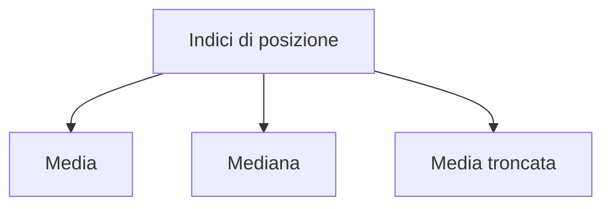
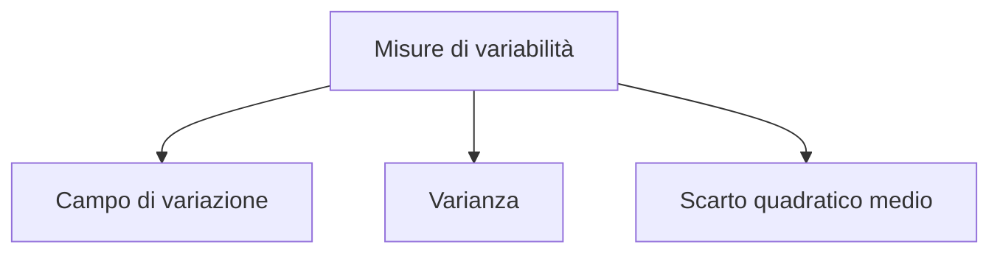
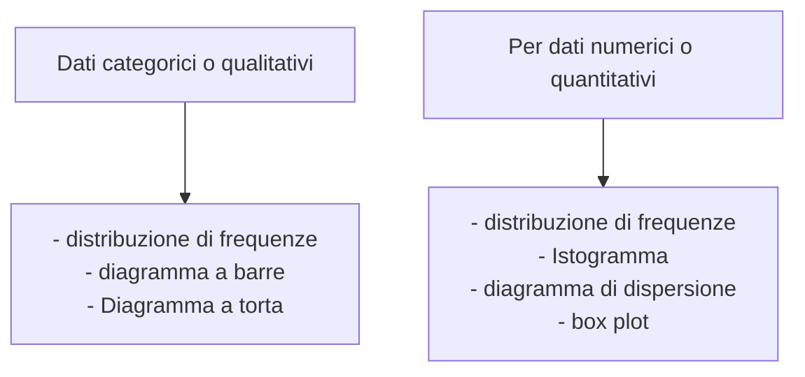
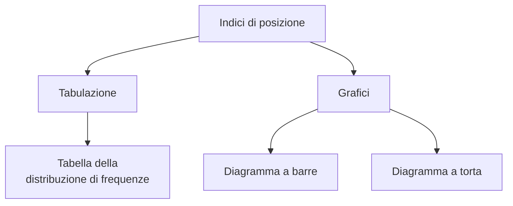
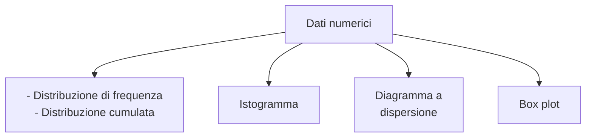

# Statistica

## Introduzione alla statistica

### Variabilità nei dati scientifici

Se nei dati non ci fosse `Variabilità`, i metodi statistici non sarebbero necessari. In sostanza la statistica ha l'obiettivo di indagare e trarre conclusioni su un fenomeno o sistema scientifico basandosi sulle leggi della **probabilità**. Il sistema scientifico si riferisce alla popolazione, ma le analisi vengono svolte su `campioni`.

L'`inferenza` è il processo tramite il quale si estraggono conclusioni o si prendono decisioni circa una popolazione sulla base dei risultati campionari.

### Determinazione del campione e disegno sperimentale

La determinazione del campione in uno studio di qualsivoglia genere dipende dal **disegno sperimentale**, che è una metodologia utilizzata per pianificare e organizzare esperimenti in modo da raccogliere dati affidabili e validi che possano rispondere a specifiche domande di ricerca. Lo scopo principale del disegno sperimentale è garantire che i risultati ottenuti siano accurati, interpretabili e utili per fare inferenze, riducendo al minimo le distorsioni o errori sistematici.

**Elementi chiave del disegno sperimentale**

1. **Fattori**: Sono le variabili indipendenti che il ricercatore manipola o controlla per vedere come influenzano le variabili dipendenti. I fattori possono avere diversi livelli (es. un farmaco somministrato a diverse dosi).

2. **Variabili dipendenti**: Sono gli esiti o le risposte che si osservano e si misurano nell'esperimento, influenzate dalle variabili indipendenti.

3. **Unità sperimentali**: Sono gli oggetti, individui o elementi sui quali si conduce l'esperimento. Possono essere soggetti umani, animali, piante, gruppi o qualsiasi altro oggetto di studio.

4. **Randomizzazione**: È il processo con cui si assegna casualmente ogni unità sperimentale a uno dei gruppi (trattamenti) per garantire che le differenze osservate tra i gruppi siano attribuibili ai trattamenti e non ad altri fattori. La randomizzazione riduce il rischio di bias (distorsione) nei risultati.

5. **Ripetizioni**: La replica delle condizioni sperimentali su più unità sperimentali. Questo aumenta l'affidabilità e la generalizzabilità dei risultati, permettendo di stimare la variabilità all'interno e tra i gruppi.

6. **Controllo**: Si riferisce all'utilizzo di un gruppo di controllo (che non riceve il trattamento o riceve un trattamento standard) per confrontare gli effetti del trattamento principale e isolare l'effetto delle variabili sperimentali.

7. **Blocco**: Si tratta di suddividere le unità sperimentali in gruppi omogenei (blocchi) in base a una caratteristica che potrebbe influenzare i risultati. Questo approccio aiuta a controllare per le variabili che potrebbero confondere l'esperimento.

Quando il disegno sperimentale non può essere definito si parla di **studio osservazionale**.

![[Secondo Anno/Statistica/1.png]]

### Statistica descrittiva vs. inferenza

Nella **statistica descrittiva**, il ricercatore o l'ingegnere è interessato solo a riassumere e sintetizzare i dati del campione, mentre nella **statistica inferenziale e nella probabilità** le informazioni del campione vengono utilizzate assieme al disegno sperimentale per trarre informazioni sulla popolazione, ovvero sul sistema di indagine.

La probabilità è la base su cui ci si fonda l'inferenza statistica e ci permette di capire l'importanza delle conclusioni ottenute con l'applicazione dell'inferenza al campione.

### Scelta del campione

Il **campionamento casuale semplice** è il procedimento di scelta del campione nel quale

- Ciascuna unità della popolazione è scelta rigorosamente a caso

- Ciascuna unità della popolazione ha la stessa opportunità di essere scelta

- Ogni possibile campione di dimensione $n$ ha la stessa possibilità di essere selezionato

Il vantaggio di questo tipo di campionamento è che rappresenta il miglior modo di di mantenere una rappresentatività della popolazione senza incorrere in **bias sistematico** (distorsione sistematica).

Per ridurre ulteriormente il rischio di avere un campione sproporzionato è possibile utilizzare la tecnica del **campionamento a strati**, in cui si scelgono opportuni strati da cui poi vengono estratti a caso i campioni in egual numero per strato. L'unico svantaggio di fare in questo modo è che si aumenta la complessità e il dispendio di tempo ed energie del campionamento in quanto servono più elementi.

Il **campionamento sistematico** prevede che si selezioni una unità ogni $j$, dove

- $j=\frac{N}{n}$

- $N$ è la dimensione della popolazione

- n è la dimensione desiderata del campione.

In pratica si prende un elemento ogni $j$ in una lista ordinata composta dalla popolazione.

## Statistica descrittiva

La **statistica descrittiva** si occupa di:

- Collezionare i dati rilevanti allo studio in questione

- Sintetizzare i dati con indici di posizione e variabilità

- Presentarli alla persona preposta a riceverli mediante l'utilizzo di tabelle e grafici

![[Secondo Anno/Statistica/2.png]]

Questi indici rappresentano un intero set di dati mediante l'utilizzo di un solo valore significativo.

### Indici di posizione

- La **media** aritmetica è la sommatoria di tutti i valori fratto il numero dei valori

$$
\bar{X}=\frac{\sum_{i=1}^n x_i}{n}
$$

- La **mediana** è il valore centrale della lista ordinata dei valori campionari. Se i dati sono in numero pari si fa la media dei due valori centrali.

- La **media troncata** è una media che rimuove una certa percentuale di valori a destra e a sinistra per ridurre l'influenza dei valori estremi in quanto possono essere troppo distanti dal centro.

- La **moda** è una misura di tendenza centrale, quindi il valore che occorre più frequentemente. Viene prevalentemente usata su dati **categorici** anche se è possibile usarla anche con dati **numerici**. E' possibile che ci sia più di una moda o che non ci sia.

### Misure di variabilità

Le misure di variabilità riassumono il set di dati in termini di **dispersione** o **variabilità** dei valori. Due set di dati potrebbero avere la stessa media ma diversa variabilità.

#### Campo di variazione

E' la differenza tra il massimo e il minimo dei valori del set di dati. Quindi un'indicazione di che intervallo possono avere i dati.

$$
\text{Campo di variazione}=X_{\text{massimo}} - X_{\text{minimo}}
$$

![[Secondo Anno/Statistica/3.png]]

Il problema del campo di variazione è che ignora il modo in cui i dati sono distribuiti perché considera solo il massimo e il minimo. Inoltre è sensibile agli outliners.

![[Secondo Anno/Statistica/4.png]]

#### Varianza campionaria

La **varianza campionaria** calcola la dispersione soltanto su un campione della popolazione e non su tutto l'insieme.

$$
S^2= \frac{1}{(n-1)^{\sum_{i=1}^n (X_i-X)^{-2}}}
$$

#### Deviazione standard campionaria

Musura la variabilità rispetto alla media

$$
S=\sqrt{\frac{\sum_{i=1}^n (X_i+\bar{X})^2}{n-1} }
$$

![[Secondo Anno/Statistica/5.png]]

#### Rappresentazione grafica dei dati

I dati grezzi non sono facili da usare nel processo decisionale, quindi ci si affida a grafici e tabelle, il cui tipo dipende dai dati che si vogliono sintetizzare.

#### Forma della distribuzione e simmetria negli istogrammi

- La forma della distribuzione in un istogramma si dice **simmetrica** se i dati sono distribuiti o bilanciati in modo approssimativamente regolare rispetto al centro (media).

- Se la forma della distribuzione è asimmetrica, cioè è più concentrata da una parte del grafico, può essere detta
  
  - **Asimmetrica positiva** se ha una coda che si estende verso i valori più alti, tipicamente a destra
  
  - **Asimmetrica negativa** se ha una coda che si estende verso i valori più bassi, tipicamente a sinistra

#### Scatterplot (diagramma di dispersione)

Si usa per accoppiare due set di dati diversi su un unico grafico, come ad esempio volume vendite e costo d'acquisto della materia prima. Un set viene visualizzato sull'asse X e l'altro sull'asse y.

#### Box plot: i Quartili

I **Quartili** dividono la sequenza ordinata dei dati in 4 segmenti contenenti lo stesso numero di valori

![[Secondo Anno/Statistica/8.png]]

- Il primo quartile, $Q1$, è il valore per il quale 25% delle osservazioni sono minori e 75% sono maggiori di esso

- $Q2$ coincide con la mediana (50% sono minori, 50%sono maggiori)

- Solo 25% delle osservazioni sono maggiori del terzo quartile $Q3$

![[Secondo Anno/Statistica/9.png]]

$Q1 = 0.25(9+1)=2.5$ posizione. In questo caso il primo quartile si trova tra due valori, quindi facciamo la media: $Q1=12.5$.

#### Box plot e differenza interquartile

Il box-plot si basa sulla differenza interquartile, quindi il **campo di variazione** del 50% centrale dei dati. Se prendiamo il 3° quartile e e gli togliamo il 1°, avremo il numero dei dati contenuti nel 50% centrale dell'intero campione.

$$
IQR=Q3-Q1
$$

![[Secondo Anno/Statistica/10.png]]

## Enumerazione dei punti campionari e probabilità

Caso 1

- Una società ha partecipato a 5 progetti per l’anno venturo,ma non sa quanti se ne aggiudicherà (min: 0, max: 5).

- La società con il personale a pieno servizio può garantire la copertura di 3 progetti. Se i progetti vinti fossero 4 o 5, servirebbe nuovo personale.

- La probabilità riferita al realizzarsi dell’evento (A): «vincita di 4 o più progetti» dà indicazione alla società su assumere o meno altro personale. Se P(A) = 0.8 →assumere. Se P(A) = 0.2 →non assumere

Per effettuare uno studio sperimentale bisogna prendere dei campioni. I dati che raccolgo con i campioni sono caratterizzati da incertezza in quanto i campioni sono scelti randomicamente.

`La probabilità si occupa di definire l'insieme degli eventi che si possono realizzare in un esperimento e assegnare a ciascuno una probabilità`

- `Esperimento aleatorio`: un processo che porta ad un risultato incerto **lancio del dado**

- `Evento elementare`: possibile esito dell'esperimento **tutti i risultati**

- `Spazio campionario`: insieme di tutti gli eventi elementari in un esperimento
  
  $$
  S=\{1,2,3,4,5,6\}
  $$

- `Evento`: qualsiasi sottoinsieme di uno o più eventi elementari che compongono lo spazio campionario **qualsiasi cosa esca**

- `Evento certo`: insieme di tutti gli eventi elementari

- `Evento impossibile`: assenza di eventi elementari **esce 9**

### Intersezione di Eventi

Se $A$ e $B$ sono due eventi in uno spazio campionario $S$, allora l’intersezione,$A\cap B$, è l’insieme di tutti gli eventi elementari in $S$ che appartengono sia ad $A$ che a $B$

![[/Users/xtc/Desktop/Schermata 2024-09-23 alle 10.01.00.png]] Diagramma di Venn

$A$ e $B$ sono eventi mutuamente esclusivi se non hanno in comune alcun evento elementare

![[/Users/xtc/Desktop/Schermata 2024-09-23 alle 10.02.00.png]]

### Unione di Eventi

Se $A$ e $B$ sono due eventi in uno spazio campionario $S$, allora l’unione, $A\cup B$, è l’insieme di tutti gli eventi elementari di $S$ che appartengono ad $A$ oppure a $B$

![[/Users/xtc/Desktop/Schermata 2024-09-23 alle 10.03.26.png]]

Gli eventi $E1, E2, … Ek$ sono `collettivamente esaustivi` se e solo se $E1 \cup E2 \cup \dots \cup Ek = S$

L’ evento complementare di un evento $A$ è l’insieme di tutti gli eventi elementari nello spazio campionario che non appartengono ad $A$. L’evento complementare (contrario) è indicato da $\bar{A}$

![[/Users/xtc/Desktop/Schermata 2024-09-23 alle 10.06.46.png]]

### Esempio

Considera lo spazio campionario dato dalla collezione di tutti i possibili risultati ottenibili dal lancio di un dado

$$
S=[1,2,3,4,5,6]
$$

![[/Users/xtc/Desktop/Schermata 2024-09-23 alle 10.10.02.png]]

Sia $A$ l’evento “Il risultato è un numero pari”

Sia $B$ l’evento “Il risultato è un numero maggiore o uguale a 4”

$$
A=[2,4,6]
$$

$$
B=[4,5,6]
$$

- Complementari (o contrari):
  
  $$
  \bar{A}=[1,3,5] \qquad \bar{B}=[1,2,3]
  $$

- Intersezioni
  
  $$
  A\cap B=[4,6]\qquad \bar{A}\cap B=[5]
  $$

- Unioni
  
  $$
  A\cup B = [2,4,5,6] \qquad A\cup\bar{A}=[1,2,3,4,5,6]=S
  $$

### Enumerazione dei punti campionari

Uno dei problemi che lo statistico deve affrontare è saper governare la casualità associata al verificarsi di un evento in un esperimento. Spesso è sufficiente contare il numero dei punti campionari e quanti di questi soddisfino un dato esempio.Un principio fondamentale per enumerare i punti campionari è il **metodo moltiplicativo**.

`Se una operazione può essere effettuata in n1 modi (i.e., un esperimento può avere n1 possibili esiti), e se per ciascuna di esse, una seconda operazione può essere svolta in n2 modi, allora le due operazioni possono essere effettuate insieme in n1*n2 modi`

#### Permutazioni

Una **permutazione** è una sequenza ordinata di un insieme di oggetti senza ripetizione. In generale, $n$ oggetti distinti possono essere ordinati senza ripetizione in $n (n-1) (n-2) …(2)(1)$ modi, cioè $n!$.

Possiamo anche avere una permutazione di $r$ elementi in uno spazio di $n$ possibilità. In generale, si avranno $n(n-1)(n-2) …(n-r+1)$ modi di  permutare n oggetti r alla volta

$$
_nP_r=\frac{n!}{(n-r)!}
$$

Permutazioni di $n$ elementi in k categorie o $r$ sottoinsiemi:

$$
\frac{n!}{n_1!n_2!...n_{k||r}!}
$$

#### Combinazioni

Il numero di **combinazioni** senza ripetizione è dato da:

$$
\begin{pmatrix}
n \\
r
\end{pmatrix} = \frac{n!}{r!(n-r)!}
$$

![[Secondo Anno/Statistica/6.png]]

### Probabilità di eventi

![[Secondo Anno/Statistica/7.png]]

La **probabilità** è la possibilità che un evento, che sappiamo essere incerto, si manifesti $0\le P(A)\le1$

Ci sono tre approcci per valutare la probabilità di un evento incerto

- **Probabilità classica**
  
  $$
  A=\frac{N_A}{N}=\frac{\text{numero di eventi elementari chesoddisfano la condizione dell' evento}}{\text{numero complessivo di eventi elementari dello spazio campionario}}
  $$
  
  Tutti i risultati dello spazio campionario sono **ugualmente probabili** e il numero degli eventi elementari si determina attraverso una permutazione o una combinazione.

- **Interpretazione frequentistica**
  
  $$
  A=\frac{n_A}{N}=\frac{\text{numero di osservazioni che soddisfano l'evento A nei dati}}{\text{numero complessivo di osservazioni disponibili}}
  $$

- **Probabilità soggettiva**
  
  Che è un'opinione o credenza individuale circa la possibilità del verificarsi di un certo evento
